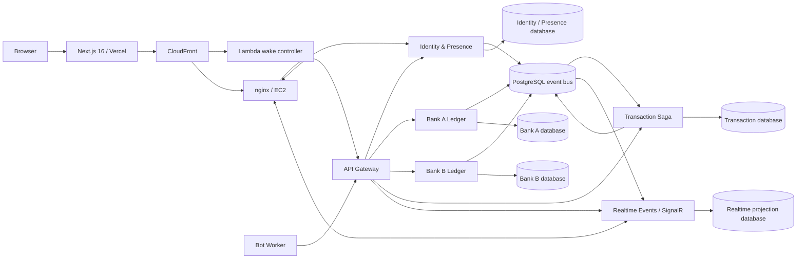
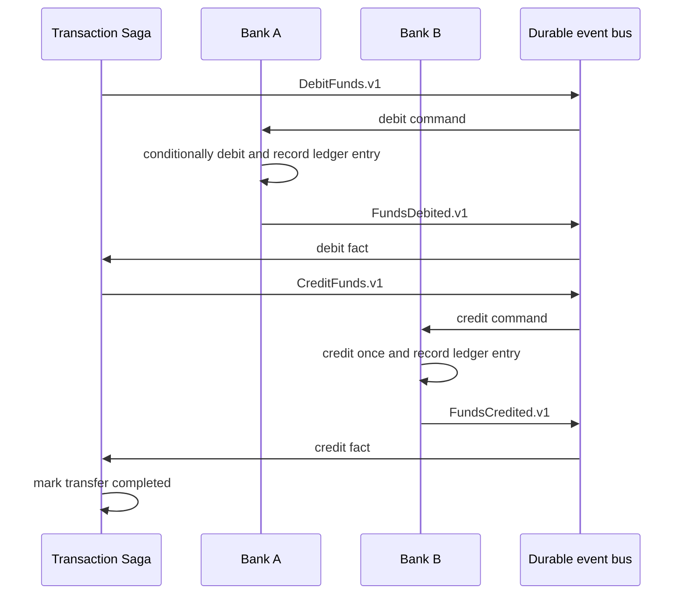

# Real-Time PIX Platform — System Showcase

**Status:** live educational demo  
**Public web application:** <https://realtime-pix-web.vercel.app>  
**Backend region:** AWS `us-east-2`  
**Purpose:** demonstrate reliable, observable cross-bank money-transfer workflows using fictional balances and identities.

> This is not connected to Brazil's real PIX rail, does not process real money, and is not a production banking system. It is an engineering showcase of the patterns required to make a distributed financial workflow understandable and resilient.

## Executive summary

Real-Time PIX Platform is an event-driven microservices monorepo. A transfer between two fictional banks is coordinated as an **orchestrated Saga**: each bank commits locally, publishes a durable fact, and the transaction coordinator advances or compensates the workflow. The system deliberately avoids distributed database transactions.

The project combines a .NET 10 backend, PostgreSQL 16, transactional outbox/inbox delivery, versioned events, ASP.NET Core SignalR, a Next.js 16 user interface, Docker Compose, Terraform, GitHub Actions, Vercel, and an on-demand AWS runtime. It is designed for a small public demonstration—approximately ten concurrent users—while retaining the reliability concepts that matter in real distributed systems.

## What the platform demonstrates

- A cross-bank transfer with debit, credit, timeout, compensation, and manual-intervention paths.
- Event-driven coordination using commands and immutable integration events.
- Transactional outbox and durable inbox patterns for reliable at-least-once delivery.
- Idempotent money operations and database-level balance invariants.
- Live presence and transfer-state visualization through SignalR.
- Service-owned data and Clean Architecture boundaries.
- Low-cost public deployment with an explicit cold-start/cost trade-off.
- Automated quality, security-hygiene, infrastructure, and container-build checks.

## System topology



The source code is a monorepo, but its runtime services and data ownership remain separated. **No service reads another service's database.**

## Runtime services

| Component | Responsibility |
| --- | --- |
| API Gateway | Public application API and routing to backend capabilities. |
| Identity / Presence Service | Anonymous demo identity, participant/session lifecycle, and presence state. |
| Bank Ledger Service — Bank A | Sender-bank balance, conditional debit, credit/refund, and ledger records. |
| Bank Ledger Service — Bank B | Recipient-bank balance and ledger records. |
| Transaction Service | Durable Saga coordinator and source of transfer workflow state. |
| Realtime Events Service | Transfer projections and live activity delivery. |
| Bot Worker | Generates demo activity through the same public workflow. |
| PostgreSQL Event Bus | Durable topics and queues used for commands and integration events. |
| nginx | Routes direct API and SignalR traffic on the application host. |

## Transfer workflow: orchestrated Saga

The Transaction Service is the coordinator. A transfer is a sequence of local commits and messages, not one cross-database transaction.



### Normal path

1. Transaction Service writes `debit_pending` and `DebitFunds.v1` atomically.
2. Bank A claims the operation, conditionally debits the balance, writes a ledger entry, and emits `FundsDebited.v1`.
3. Transaction Service writes `credit_pending` and `CreditFunds.v1`.
4. Bank B credits exactly once and emits `FundsCredited.v1`.
5. Transaction Service records a completed transfer.

### Failure and compensation path

If credit is rejected or the Saga times out after debit, the coordinator sends `RefundFunds.v1` to Bank A. A successful refund completes the transfer as `compensated`. If compensation itself fails, the Saga enters `manual_intervention`, explicitly preserving the unresolved liability for an operator rather than silently hiding it.

This is a Saga because each participant commits locally and compensation is a business operation; it is not a database rollback.

## Events, messages, and queues

The platform is event-driven. It uses a **durable PostgreSQL-backed topic/queue transport** instead of a managed broker such as Kafka, RabbitMQ, AWS SQS/SNS, or Azure Service Bus. This is deliberate: it reduces cost and operational overhead for the demo while preserving the important delivery semantics.

### Message types

| Category | Examples | Routing |
| --- | --- | --- |
| Commands | `DebitFunds.v1`, `CreditFunds.v1`, `RefundFunds.v1` | Directed to the applicable bank queue. |
| Bank outcomes | `FundsDebited.v1`, `FundsDebitRejected.v1`, `FundsCredited.v1`, `FundsCreditRejected.v1`, `FundsRefunded.v1`, `FundsRefundRejected.v1` | Published as integration events. |
| Operational facts | `SagaTransitionRecorded.v1`, `PixSagaTimedOut.v1`, `PixTransferCompleted.v2`, `PixTransferFailed.v2`, `PixTransferCompensated.v1` | Consumed by projections and operational views. |

Integration events are published to `platform-events` and filtered into consumer subscriptions. Event envelopes use CloudEvents 1.0-style names and carry the event ID, event type/version, occurrence time, producer, destination, correlation and causation IDs, content type, payload, and W3C trace context.

### Delivery guarantees and correctness

The transport is **at least once**, which means a message may arrive more than once. Correctness is achieved in the application and database rather than by assuming perfect broker delivery:

- An **outbox** row is written in the same database transaction as the business state change.
- Background dispatchers claim work with PostgreSQL `FOR UPDATE SKIP LOCKED`, publish it, retry ambiguous results, and retain exhausted messages for inspection and recovery.
- Each consumer records `(consumerName, eventId)` in a durable **inbox**.
- Bank operations use a unique `(transferId, operationType)` key.
- Debit is a single conditional SQL update, preventing concurrent negative balances.
- Saga transitions use durable state and optimistic concurrency; event arrival order is never assumed across entities.

As a result, a replayed or duplicated message must not alter a balance, duplicate a ledger row, repeat a Saga transition, or corrupt a realtime projection.

## Data model and ownership

PostgreSQL 16 stores six separate logical databases:

| Database | Owner |
| --- | --- |
| Identity / Presence | Identity and Presence Service |
| Bank A | Bank A Ledger Service |
| Bank B | Bank B Ledger Service |
| Transaction | Transaction Saga Service |
| Realtime Projection | Realtime Events Service |
| Event Bus | Shared durable transport implementation, not a shared business database |

The boundary is intentional: services integrate through contracts and events, never through a foreign service's EF entities, tables, or domain models.

## Software architecture and SOLID

Each backend service follows the dependency direction:

```text
Domain  ←  Application  ←  Infrastructure  ←  API / Worker composition root
```

| Layer | Role |
| --- | --- |
| Domain | Business entities, invariants, and rules without framework dependencies. |
| Application | Use cases and ports/interfaces needed by the domain workflow. |
| Infrastructure | PostgreSQL, EF Core, event transport, web, and hosting implementations. |
| API / Worker | Dependency wiring, HTTP endpoints, background-process startup, and configuration. |

This structure is a practical application of SOLID principles:

- **Single Responsibility:** ledger mutation, workflow coordination, presence, projection, and transport each have focused responsibilities.
- **Open/Closed:** adapters and ports allow infrastructure concerns to change without rewriting core business rules.
- **Liskov Substitution:** application code relies on contracts that can be fulfilled by alternate adapters.
- **Interface Segregation:** contracts are specific—commands, events, and focused ports—not a single platform-wide interface.
- **Dependency Inversion:** domain/application rules do not depend directly on HTTP, SignalR, EF Core, Docker, or PostgreSQL.

Architecture tests enforce project-reference direction, so these rules are executable rather than aspirational. Shared code is limited to integration schemas and reusable transport/persistence/web adapters; it never contains a service's domain model or database entities.

## Frontend and design system

The public client is a **Next.js 16 + React + TypeScript** application deployed on Vercel. It communicates with the runtime API and direct SignalR endpoints through the AWS edge.

The UI has two intentional modes:

- **Simple mode:** makes a transfer journey accessible to a non-specialist audience.
- **Expert mode:** exposes service activity, event progression, failure/compensation states, and operational context.

### Design language

The visual system is designed to make asynchronous distributed behavior legible:

- Dark operations-console visual language.
- Transaction journey/map visualization for otherwise invisible distributed states.
- Consistent service-node, card, status, activity-journal, and motion patterns.
- Clear state colors for progress, success, warning, failure, and intervention.
- Responsive desktop and mobile layouts.
- Live room activity and presence feedback, not merely static dashboard metrics.

The design system is cohesive at application level. It is not yet formalized as a separate token package, documented component library, or Storybook catalog; that would be a logical future enhancement rather than a missing requirement for this showcase.

## Realtime system

ASP.NET Core SignalR delivers presence and transfer timeline updates through nginx and CloudFront. Realtime delivery supports user experience and observability; the transactional database and durable event stream remain the source of truth.

This distinction matters: a browser can disconnect, reconnect, miss UI messages, or receive a duplicate visual update without changing the financial workflow. The UI can rebuild correct state from durable backend data.

## Cloud architecture

### Active services

| Capability | Service / implementation | Decision |
| --- | --- | --- |
| Public frontend | Vercel Hobby | Fast static/Next.js delivery with preview deployments. |
| Public runtime edge | Amazon CloudFront | One controlled edge entry point for runtime traffic and wake endpoint. |
| Runtime compute | One Amazon EC2 instance with Docker Compose | Lowest-complexity host appropriate for the ten-user demo. |
| Application edge | nginx | Routes APIs and direct SignalR connections. |
| Data and messaging | PostgreSQL 16 containers on encrypted EBS | Separate logical databases plus durable event bus, kept private to Docker networking. |
| Runtime control | AWS Lambda, Function URL, EventBridge, DynamoDB | Starts the known host, records activity, and enforces idle/daily limits. |
| Configuration | AWS Systems Manager Parameter Store SecureString | Keeps runtime environment values outside source control. |
| Images | GitHub Container Registry | Immutable commit-pinned deployment tags. |
| Backups and Terraform state | Private encrypted Amazon S3 | Off-host recovery material and remote state. |
| Cost notification | AWS Budgets | USD 15 monthly alert; it is not a billing hard-stop. |

Azure is intentionally not part of the active runtime or current infrastructure definition.

### On-demand behavior and cost control

The browser calls `/runtime/wake` through CloudFront when a cold runtime must be started. The Lambda controller starts only the Terraform-managed EC2 instance, waits for dependency readiness, and records activity. A periodic controller check stops the host after 20 minutes of inactivity and permits up to 24 aggregate runtime hours per UTC day.

This is a conscious product decision:

- It allows a public demo to remain inexpensive.
- It creates a possible cold-start wait for the first visitor.
- The daily allowance is shared by all visitors.
- It controls EC2 runtime, not every AWS cost: EBS, public IPv4, S3, CloudFront, Lambda, DynamoDB, logs, snapshots, and data transfer can still incur charges.

## Infrastructure as code and operations

Terraform under `infra/terraform/aws-runtime` is the sole supported cloud infrastructure definition. Its remote-state configuration is intentionally partial, so no account-specific state bucket name is committed to the repository.

Operational safeguards include:

- Encrypted EC2/EBS and encrypted private S3 objects.
- Database ports not published publicly.
- A CloudFront-origin header validated by both controller and nginx; browsers never receive it.
- Instance-role access to the runtime SecureString rather than credentials embedded in images or code.
- Backup role can write to its backup prefix but cannot delete objects.
- Commit-pinned image releases (`aws-<commit-sha>`), never a mutable `latest` tag.
- `delete_on_termination = false` for the volume to avoid accidental loss of demo data.
- AMI/bootstrap changes intentionally handled through SSM rather than replacing the instance and its data volume.

Routine host changes are delivered through AWS Systems Manager. A release is verified through readiness, SignalR, successful transfer, compensated transfer, presence expiry, idle shutdown, and stopped-host cold-start checks.

## CI/CD and quality gates

GitHub Actions runs on pull requests, `main` pushes, and manual dispatch with least-privilege `contents: read` permissions.

| Pipeline area | Verification |
| --- | --- |
| Wake controller | Python unit tests for runtime-control logic. |
| Backend | Restore, .NET formatting check, Release build, unit tests, architecture tests, PostgreSQL integration tests. |
| Dependencies | Fails on vulnerable direct or transitive NuGet packages; frontend fails `npm audit` at high severity or above. |
| Frontend | Clean install, automated tests, and production Next.js build. |
| Infrastructure | Recursive Terraform format check plus no-backend Terraform validation. |
| Containers | Docker build for API Gateway, Presence, Ledger, Transaction, Realtime Events, and Bot images. |
| Public-repo hygiene | Blocks committed state files, `.env`, generated reports, common credential patterns, and environment-specific artifacts. |
| Deployment | GitHub publishes runtime images; Vercel deploys the frontend and preview automation exercises browser behavior. |

The project also uses browser-level tests for transfer journeys, layout behavior, and multi-session presence scenarios.

## Security posture

The project has a sensible security baseline for a public educational demo:

- Runtime secrets/configuration are held in SSM SecureString rather than committed files.
- Sensitive/generated files are blocked by repository hygiene checks.
- Cloud ingress is constrained and database ports stay private.
- CloudFront-to-origin traffic carries a private validated header.
- Container images are immutable by commit tag.
- EBS and S3 backup/state storage are encrypted.
- Dependency vulnerability checks run in CI.
- Repository secret scanning found no open alerts during the cleanup review.
- CORS permits the production frontend and verified Vercel preview origins rather than a blanket permissive origin.

### Explicit security boundary

This is **not** security-complete for real financial activity. It intentionally uses anonymous demo identities and synthetic balances. A production-grade successor would need, at minimum, customer authentication, authorization/RBAC, secure customer data handling and retention, fraud/AML controls, WAF/rate limiting, security monitoring, formal secret rotation, a threat model, compliance controls, and incident/recovery procedures.

## Repository map

| Path | Contents |
| --- | --- |
| `apps/web` | Next.js UX, realtime client logic, unit tests, and Playwright tests. |
| `services` | API Gateway, Identity/Presence, Ledger, Transaction, Realtime, and Bot services. |
| `building-blocks/dotnet` | Reusable eventing, persistence, and web-hosting adapters. |
| `contracts/dotnet` | Versioned integration contracts and event schemas. |
| `infra/terraform/aws-runtime` | AWS controller, Terraform, Compose host definition, backups, and runbooks. |
| `tests` | Unit, architecture, host, and PostgreSQL integration tests. |
| `docs/architecture` | Architecture overview, event catalog, cloud model, and ADRs. |

## Architectural decisions captured in ADRs

| ADR | Decision | Why it matters |
| --- | --- | --- |
| 001 | Orchestrated Saga | Makes cross-bank progress, recovery, and compensation explicit without distributed transactions. |
| 002 | Clean Architecture per service | Keeps domain rules independent of frameworks and makes dependencies testable. |
| 003 | Bank boundaries | Preserves independent ownership and prevents accidental shared-database coupling. |
| 004 | Transactional outbox and durable inbox | Preserves intent-to-publish and makes duplicate delivery safe. |
| 005 | Terraform model | Captures the small AWS/Vercel runtime in reviewable infrastructure as code. |

## What is strong today

1. **Correctness-first workflow design.** The system treats retries, duplicate delivery, partial failure, and compensation as normal conditions.
2. **Clear bounded contexts.** Bank A, Bank B, transaction coordination, presence, and realtime projection have distinct ownership.
3. **High explanatory value.** The interface visually explains a distributed transaction rather than concealing it behind a single “success” notification.
4. **Proportionate operations.** The AWS/Vercel topology fits a small demo without requiring a costly or hard-to-operate production fleet.
5. **Executable engineering standards.** Formatting, tests, architecture constraints, dependency checks, Terraform checks, Docker builds, and repository hygiene are automated.
6. **Transparent trade-offs.** The documentation explicitly describes cost limits, cold starts, single-host risk, and non-production scope.

## Intentional limitations and next-stage improvements

| Area | Current position | If evolving beyond a showcase |
| --- | --- | --- |
| Availability | One EC2 host and one physical PostgreSQL host. | Multi-AZ managed data, redundant compute, readiness/load balancing, recovery objectives. |
| Messaging | PostgreSQL topic/queue transport. | Evaluate managed SQS/SNS, Kafka, or RabbitMQ based on volume, ordering, and operational needs. |
| Realtime scale | Direct SignalR on one host. | Introduce a SignalR backplane and horizontal scale strategy. |
| Identity | Anonymous demo sessions. | Real authentication, authorization, tenant/customer boundaries, audit identity. |
| Financial controls | Fictional balances only. | Fraud/AML, reconciliation, compliance, retention, immutable audit controls. |
| Observability | Strong visible workflow information. | OpenTelemetry traces/metrics/logs, alerting, SLOs, dashboards, and incident playbooks. |
| Supply chain | CI build/audit/hygiene checks. | Add SBOM generation, image scanning, IaC security scanning, and provenance/signing. |
| Design system | Consistent application-level visual language. | Formal design tokens, accessible component primitives, Storybook, and usage documentation. |
| Deployment operations | SSM-driven host changes protect the single data volume. | Immutable/rolling release model, automated migration checks, and restore drills. |

## Suggested LinkedIn framing

> I built Real-Time PIX Platform as a public distributed-systems showcase: a fictional cross-bank PIX transfer that makes the difficult parts visible. Instead of a single synchronous request, transfers run as an orchestrated Saga with durable events, transactional outbox/inbox delivery, idempotent ledger operations, compensation/refund paths, and realtime SignalR visualization. The stack combines .NET 10, PostgreSQL, Next.js 16, Docker, Terraform, GitHub Actions, Vercel, and a cost-controlled AWS runtime. It is intentionally a ten-user educational demo—not real PIX or real money—but the architecture focuses on the reliability patterns that matter when a workflow spans independent services.

## Further reading

- [Project README](../README.md)
- [Architecture overview](architecture/README.md)
- [Event contracts](architecture/events.md)
- [Architecture decision records](architecture/decisions/README.md)
- [Cloud provisioning model](architecture/cloud-provisioning.md)
- [Deployment guide](deployment/README.md)
- [AWS runtime operations](../infra/terraform/aws-runtime/README.md)
- [Security policy](../SECURITY.md)
