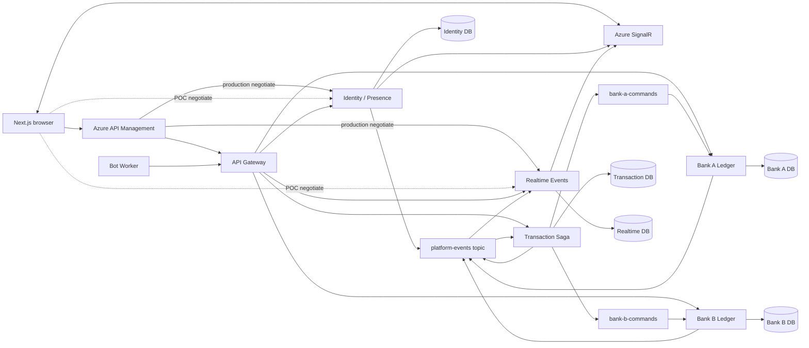
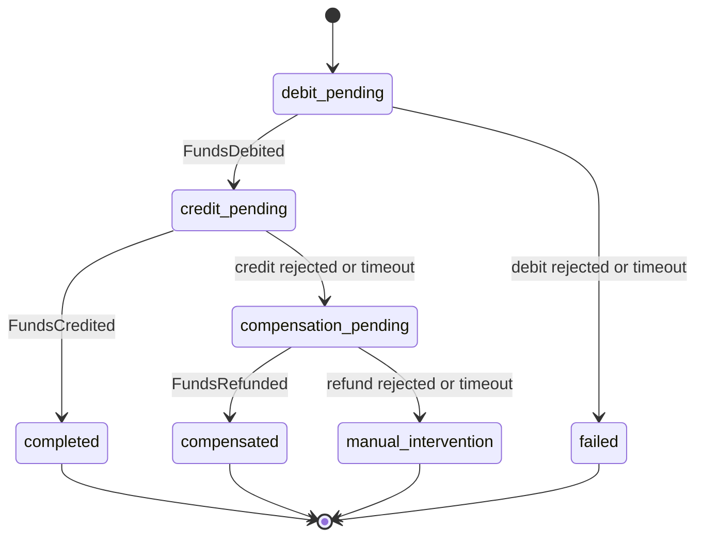

# Architecture

This is a microservices monorepo: source control is shared, but runtime processes, managed identities, message endpoints, and data ownership are separate. No service reads another service's database.

## System Context



## Orchestrated Saga

The Transaction service is the durable coordinator. Banks never participate in a distributed database transaction.



Each transition requires the expected current state and optimistic version. The coordinator persists both the updated aggregate and an append-only transition record before its outbox publishes the next command/event.

The normal cross-bank path is:

1. Transaction persists `debit_pending` and `DebitFunds.v1` in one local transaction.
2. The sender bank atomically claims `(transferId, pix-debit)`, conditionally debits, writes its ledger entry, and stores `FundsDebited.v1` in its outbox.
3. Transaction advances to `credit_pending` and stores `CreditFunds.v1`.
4. The recipient bank credits once and emits `FundsCredited.v1`.
5. Transaction advances to `completed` and publishes terminal events.

Credit failure or timeout issues `RefundFunds.v1`. Refund success ends `compensated`; refund failure ends `manual_intervention` and leaves an explicit unresolved Saga liability for operations.

## Reliability Model

- Delivery is at least once. Database idempotency, not broker duplicate detection, is authoritative.
- Bank operations have a unique `(transferId, operationType)` key and are atomically claimed with PostgreSQL `ON CONFLICT DO NOTHING`.
- Debit uses one conditional SQL update, so concurrent requests cannot create a negative balance.
- Consumer inbox keys are `(consumerName, eventId)`.
- Outbox dispatchers claim batches with `FOR UPDATE SKIP LOCKED`, retry ambiguous publishes, and retain exhausted messages as `failed`.
- Service Bus duplicate detection is defense in depth.
- Correlation, causation, subject, trace context, producer, and schema version travel in the envelope.

## Clean Architecture

Every service has `Domain`, `Application`, `Infrastructure`, and `Api` projects; Bot uses `Worker` as its host.

```text
Domain <- Application <- Infrastructure
              ^              ^
              +------ Api/Worker (composition root)
```

- Domain contains aggregates, value objects, invariants, and no project dependencies.
- Application contains use cases and narrow ports such as `ITransferSagaRepository` and `IBankLedgerRepository`.
- Infrastructure owns EF contexts, migrations, Npgsql concurrency, Azure SDK adapters, and external HTTP.
- Hosts perform validation, map HTTP/Problem Details, and compose dependencies.
- `RealtimePix.Contracts` shares integration schemas only; EF entities and domain models are never shared.
- `RealtimePix.ArchitectureChecks` fails CI on invalid layer references and Terraform policies.

## Deliberate POC Tradeoffs

- The Azure POC uses one PostgreSQL server with five active service-owned databases; production reference uses separate private servers.
- POC Container Apps stay warm at one replica for demonstration responsiveness.
- Business services have Container Apps ingress for platform service discovery, but only APIM is the public HTTP API entrypoint. POC hub negotiation uses the two direct Container Apps URLs; the production reference sends negotiation through APIM and then connects browsers to Azure SignalR.
- The old wallet database, subscription, app, and code are retained trafficless for one release, then removed with a reviewed Terraform plan.
- `refund_rejected_test` is an automation-only failure mode. The public expert UI exposes only normal, credit rejection, and credit timeout. Production rejects every non-normal mode.

## Health Model

- `/health/live` reports only that the process is alive; it never depends on external systems.
- `/health/ready` checks each state owner's PostgreSQL connection and its event transport. Identity and Realtime also check Azure SignalR reachability; Bot checks Gateway and messaging.
- Gateway readiness aggregates Identity, both banks, Transaction, and Realtime.
- Service Bus and SignalR results are cached for 30 seconds so platform probes do not become a high-volume dependency workload.
- Readiness responses expose stable reason codes, while detailed exceptions remain in structured telemetry.
