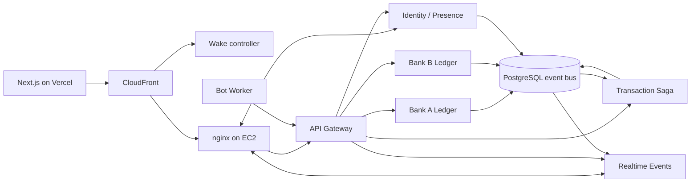

# Architecture

This is a microservices monorepo. Runtime processes and data ownership are separate even though source control and the demo host are shared. No service reads another service's database.

## Runtime flow

```mermaid
flowchart LR
    Browser[Next.js on Vercel] --> CloudFront[CloudFront]
    CloudFront --> Controller[Wake controller]
    CloudFront --> Nginx[nginx on EC2]
    Nginx --> Gateway[API Gateway]
    Nginx <--> Presence[Identity / Presence]
    Nginx <--> Realtime[Realtime Events]
    Gateway --> Presence
    Gateway --> BankA[Bank A Ledger]
    Gateway --> BankB[Bank B Ledger]
    Gateway --> Transaction[Transaction Saga]
    Gateway --> Realtime
    Bot[Bot Worker] --> Gateway
    Transaction --> Bus[(PostgreSQL event bus)]
    BankA --> Bus
    BankB --> Bus
    Presence --> Bus
    Bus --> Transaction
    Bus --> Realtime
```

Five service-owned PostgreSQL databases hold identity/presence, Bank A, Bank B, transaction, and realtime projection state. A sixth database implements durable topic/queue delivery. Direct ASP.NET Core SignalR carries presence and timeline updates through nginx and CloudFront.

## Orchestrated Saga

The Transaction service is the durable coordinator. It moves a transfer through debit, credit, and compensation states without a distributed database transaction.

1. Transaction stores `debit_pending` and `DebitFunds.v1` atomically.
2. The sender bank claims the operation, conditionally debits, records a ledger entry, and emits `FundsDebited.v1`.
3. Transaction stores `credit_pending` and `CreditFunds.v1`.
4. The recipient bank credits once and emits `FundsCredited.v1`.
5. Transaction completes, or issues `RefundFunds.v1` after a credit rejection/timeout.

Refund success ends `compensated`; refund failure ends `manual_intervention` with an explicit unresolved liability.

## Reliability model

- Delivery is at least once; database idempotency is authoritative.
- Consumer inbox keys are `(consumerName, eventId)`.
- Bank operations have a unique `(transferId, operationType)` key.
- Debit is one conditional SQL update, preventing concurrent negative balances.
- Outbox dispatchers use `FOR UPDATE SKIP LOCKED`, retry ambiguous publishes, and retain exhausted messages.
- Correlation, causation, producer, destination, schema version, and trace context travel in each envelope.

## Code boundaries

Services follow `Domain <- Application <- Infrastructure`, with API/Worker projects as composition roots. Shared projects contain transport/persistence adapters and integration schemas, never service EF entities or domain models. Architecture tests enforce project-reference direction.

## Demo tradeoffs

The backend is a single EC2 host with one replica per service and no high availability. Anonymous sessions and fictional money are deliberate. The wake controller trades cold-start latency for cost control. This topology is appropriate for a ten-user showcase, not a production financial workload.

See [cloud provisioning](cloud-provisioning.md) and the [deployment guide](../deployment/README.md).
