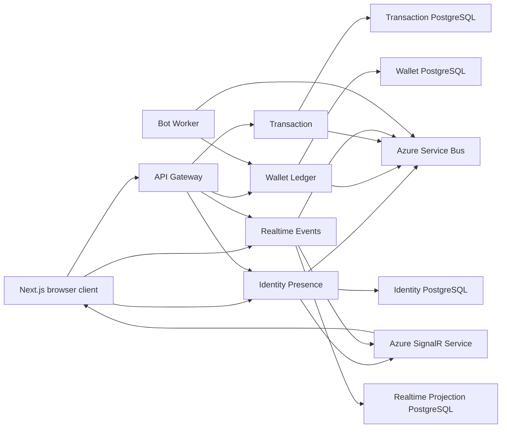

# Azure Deployment Guides

These guides describe how to deploy the Real-Time PIX Event Platform backend to
Azure Container Apps.

The current preferred path is
[GitHub, Terraform, and Azure Full Reset](github-terraform-full-reset.md). It
replaces the older Azure DevOps/manual flow with GitHub Actions plus Terraform
bootstrap, foundation, and runtime stacks.

They are intentionally split by learning stage:

1. [GitHub, Terraform, and Azure Full Reset](github-terraform-full-reset.md)
   is the recommended end-to-end reset and Azure-only backend deployment path.
2. [Recommended cloud services provisioning](recommended-cloud-services-provisioning.md)
   documents the Azure resource provisioning steps in dependency order.
3. [Cloud integration change specification](cloud-integration-change-specification.md)
   defines the application changes required before the distributed platform can
   run correctly.
4. [Azure Portal proof of concept](azure-container-apps-portal-poc.md)
   creates and configures the resources manually.
5. [Terraform and CI/CD](azure-container-apps-terraform-cicd.md) makes the
   infrastructure and application deployments repeatable through GitHub Actions
   or Azure Pipelines.

## Current Cloud-Readiness Status

The repository can be compiled and tested, but it is not yet capable of running
the complete PIX event flow across separate cloud containers.

| Area | Current implementation | Cloud consequence |
| --- | --- | --- |
| Event bus | Local JSONL or Azure Service Bus via `EventBus:Provider` | Cloud deployments must use `ServiceBus` |
| Wallet state | In-memory dictionaries | Data is lost on restart or scale-to-zero |
| Transaction state | In-memory dictionaries | Transfer state is lost on restart |
| Presence state | In-memory connection tracking | Must remain single-replica until state is externalized |
| Realtime projections | In-memory timeline and flow | Timeline is lost on restart |
| PostgreSQL | Local containers and SQL bootstrap files | Application services do not yet use the databases |
| SignalR | Direct hubs locally, optional Azure SignalR by connection string | Cloud uses Azure SignalR when `AzureSignalR:ConnectionString` is present |
| Docker | Service Dockerfiles exist | Images are built locally in GitHub Actions and pushed to ACR |

The Portal guide therefore defines two milestones:

- **Hosting proof of concept:** six independent .NET containers start, expose
  health endpoints, and communicate over internal HTTP.
- **Functional proof of concept:** the cloud event bus and PostgreSQL adapters
  are implemented, so a transfer can complete across services.

Do not interpret a successful `/health` response from all six containers as
proof that the event-driven workflow is working.

## Intended Azure Topology

For the first hosting proof of concept, Service Bus, Azure SignalR, and PostgreSQL
can be omitted. The resulting environment is useful for learning Container Apps
but is not a complete platform deployment.

## Cost Rules

- Use the Container Apps **Consumption** workload profile.
- Keep `max replicas` at `1` while service state remains in memory.
- Use `min replicas = 0` for HTTP services unless immediate response is needed.
- The bot worker requires `min replicas = 1` until it is converted to a
  scheduled or event-driven Container Apps Job.
- Use public GitHub Container Registry packages for the learning environment.
  Azure Container Registry has a separate charge.
- Log Analytics, Azure Storage for Terraform state, Service Bus, Azure SignalR, and
  database providers have their own billing rules.
- Azure budgets send alerts; they do not automatically stop resources.

## Recommended Learning Sequence

1. Read the complete Portal guide before creating resources.
2. Add and test production Dockerfiles locally.
3. Publish immutable `poc-1` images to GHCR.
4. Complete the Portal hosting proof of concept.
5. Implement the cloud event bus and persistence adapters.
6. Repeat the functional acceptance test.
7. Recreate the environment with Terraform.
8. Enable GitHub Actions or Azure Pipelines.
9. Delete the manually created Portal environment after the automated
   environment is verified.
