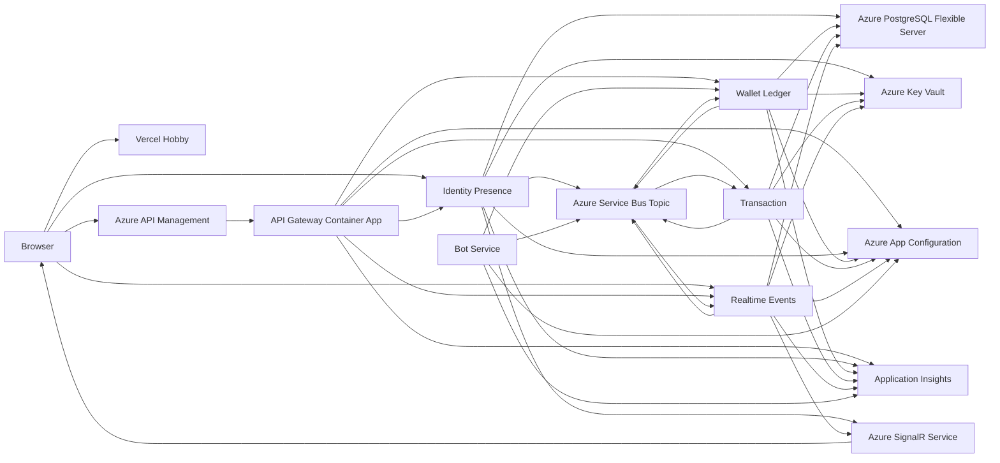

# Azure Backend and Vercel Frontend Provisioning Runbook

This runbook provisions the Real-Time PIX Event Platform with Azure and Azure
DevOps for all backend, data, messaging, registry, security, observability, and
CI/CD services. The Next.js frontend is deployed to Vercel Hobby.

It replaces the previous multi-provider backend topology:

| Previous provider/service | Selected platform |
| --- | --- |
| GitHub repository and Actions | Azure Repos and Azure Pipelines |
| GitHub Container Registry | Azure Container Registry |
| Neon PostgreSQL | Azure Database for PostgreSQL Flexible Server |
| Azure Event Grid webhooks | Azure Service Bus Standard topics/subscriptions |
| Vercel | Retained for the Next.js frontend |
| Provider-specific secret stores | Azure Key Vault |

The result remains one monorepo with six independently deployable .NET
microservices, four service-owned logical PostgreSQL databases, a managed
event broker, managed SignalR scale-out, and a Next.js frontend.

Last verified against official Microsoft and Vercel documentation:
June 18, 2026.

## 1. Credit and Free-Service Strategy

The Azure free account commonly includes:

- USD 200 credit for 30 days.
- Always-free monthly grants for selected services.
- Twelve-month grants for selected services when the account/offer is eligible.

Verify the exact benefits attached to your subscription in:

```text
Azure Portal > Cost Management + Billing > Free services
```

Do not assume every USD 200 trial or sponsorship subscription receives every
twelve-month grant. The Portal subscription benefits page is authoritative for
your account.

### 1.1 Free grants used by this architecture

At the time of this guide, Microsoft lists these relevant free amounts:

| Service | Free amount | Period |
| --- | --- | --- |
| Azure DevOps | 5 users and unlimited private Git repositories | Always |
| Azure Container Apps | 180,000 vCPU-seconds, 360,000 GiB-seconds, 2 million requests | Always, monthly |
| Azure SignalR Service | Free tier limits apply | Always |
| Azure API Management | 1 million Consumption-tier calls | Always, monthly |
| Azure App Configuration | 1,000 requests/day and 10 MB storage | Always |
| Azure Notification Hubs | 1 million pushes with a free namespace | Always |
| Azure Container Registry | 1 Standard registry, 100 GB storage, 10 webhooks | First 12 months |
| Azure Database for PostgreSQL | 750 B1ms hours, 32 GB storage, 32 GB backup | First 12 months |
| Azure Service Bus | 750 Standard-tier hours and 13 million operations | First 12 months |

Free allowances and terms can change. Review the
[Azure free services page](https://azure.microsoft.com/en-us/pricing/free-services/)
before provisioning.

Vercel Hobby is separate from the Azure credit and has its own limits and
non-commercial fair-use rules.

This architecture uses every Azure free tier that is directly applicable to
the platform. Do not provision unrelated AI, IoT, mapping, or analytics
products merely because a free grant exists; unused resources add complexity,
security surface, and possible overage costs.

### 1.2 Services expected to consume credit

These services may consume part of the USD 200 credit:

- Azure Key Vault operations.
- Azure Storage capacity and operations.
- Log Analytics/Application Insights ingestion beyond free allowances.
- Azure DNS, if a custom domain is moved to Azure DNS.
- Network egress.
- Any usage exceeding a free grant.
- PostgreSQL, ACR, or Service Bus if the subscription is not eligible for the
  twelve-month offer.

### 1.3 Important 30-day rule

The USD 200 promotional credit expires after 30 days. Before expiration:

1. Open the subscription **Overview**.
2. Confirm the credit expiration date.
3. Decide whether to upgrade to pay-as-you-go.
4. Export or back up anything that must survive.
5. Delete unnecessary resources.
6. Verify that eligible twelve-month and always-free services will remain
   available under the upgraded subscription.

## 2. Final Architecture

Provision:

| Service | Quantity | Purpose |
| --- | ---: | --- |
| Azure DevOps organization | 1 | Source control and CI/CD |
| Azure DevOps project | 1 | Repos, Pipelines, service connections |
| Azure Repos repository | 1 | Monorepo |
| Azure Resource Group | 1 | POC application resources |
| Azure Container Registry | 1 | Six backend images |
| Azure Database for PostgreSQL Flexible Server | 1 POC / 4 production | Four logical service databases |
| Azure Service Bus Standard namespace | 1 | Durable event backbone |
| Service Bus topic | 1 | Platform integration events |
| Service Bus subscriptions | 3 | Wallet, transaction, realtime consumers |
| Azure SignalR Service | 1 | Presence and event-hub scale-out |
| Azure Key Vault | 1 | Database and deployment secrets |
| Azure App Configuration | 1 | Non-secret distributed configuration |
| Log Analytics workspace | 1 | Container logs |
| Application Insights | 1 | Traces, metrics, dependency telemetry |
| Azure Container Apps environment | 1 | Backend runtime |
| Azure Container Apps | 6 | One per .NET service |
| Vercel Hobby | 1 project | Next.js frontend |
| Azure API Management Consumption | 1 | Public API policy boundary |
| Azure Storage account | 1 | Terraform state and diagnostics |
| Azure Notification Hubs | 1 optional | Future push notification adapter |
| Azure Cost Management budget | 1 | Spending alerts |

### 2.1 Runtime flow



## 3. Database Topology Decision

The application requires four logical PostgreSQL databases:

1. `identity_presence_db`
2. `wallet_ledger_db`
3. `transaction_db`
4. `realtime_projection_db`

For the credit-conscious POC, create one B1ms Flexible Server containing all
four databases. This uses one 750-hour free-server allowance while preserving
logical database ownership and separate database roles.

For a production-isolation exercise, create four Flexible Servers, one per
service. Only one server is expected to fit the single-server free allowance;
the other three consume credit and later become paid resources.

This runbook uses the one-server/four-database POC topology.

## 4. Naming Worksheet

Replace `<unique>` with a short lowercase identifier.

| Purpose | Suggested value |
| --- | --- |
| Azure region | `Brazil South`, otherwise `East US` |
| Resource group | `rg-realtime-pix-poc` |
| Azure DevOps organization | `realtime-pix-<unique>` |
| Azure DevOps project | `RealtimePixPlatform` |
| Azure Repo | `realtime-pix-platform` |
| Container Registry | `acrpix<unique>` |
| PostgreSQL server | `psql-realtime-pix-<unique>` |
| Service Bus namespace | `sb-realtime-pix-<unique>` |
| Service Bus topic | `platform-events` |
| SignalR | `signalr-realtime-pix-<unique>` |
| Key Vault | `kv-realtime-pix-<unique>` |
| App Configuration | `appcs-realtime-pix-<unique>` |
| Storage account | `strealtimepix<unique>` |
| Log Analytics | `log-realtime-pix-poc` |
| Application Insights | `appi-realtime-pix-poc` |
| Container Apps environment | `cae-realtime-pix-poc` |
| Vercel project | `realtime-pix-web` |
| API Management | `apim-realtime-pix-<unique>` |
| Notification Hub namespace | `nhns-realtime-pix-<unique>` |

Use these Azure tags:

| Tag | Value |
| --- | --- |
| `application` | `realtime-pix` |
| `environment` | `poc` |
| `owner` | Your name |
| `cost-purpose` | `learning` |
| `expires-on` | Intended review/deletion date |

## 5. Provisioning Order

Follow this order:

1. Verify subscription benefits and create a budget.
2. Create the resource group.
3. Create Azure DevOps organization, project, and repository.
4. Register Azure resource providers.
5. Create Storage for Terraform state.
6. Create Azure Container Registry.
7. Create PostgreSQL Flexible Server and four databases.
8. Create Service Bus namespace, topic, subscriptions, and filters.
9. Create SignalR, Key Vault, and App Configuration.
10. Create Log Analytics and Application Insights.
11. Create the Container Apps environment.
12. Build and push six images.
13. Create managed identities and six Container Apps.
14. Run database migrations.
15. Create the Vercel project and Azure DevOps deployment integration.
16. Create API Management and connect it to the API gateway.
17. Configure CORS and frontend environment variables.
18. Provision Notification Hubs only when starting notification work.
19. Run the end-to-end acceptance test.

## 6. Azure Subscription and Cost Controls

### 6.1 Verify subscription benefits

1. Sign in to [Azure Portal](https://portal.azure.com/).
2. Search for **Subscriptions**.
3. Open the subscription containing the USD 200 credit.
4. Record:
   - Subscription name.
   - Subscription ID.
   - Tenant ID.
   - Credit expiration date.
5. Open **Cost Management + Billing**.
6. Open **Free services**.
7. Verify whether these offers appear:
   - Azure Container Registry Standard.
   - Azure Database for PostgreSQL Flexible Server.
   - Azure Service Bus Standard.
8. Take a screenshot or record the displayed remaining quantities.
9. Do not provision multiple paid database servers until this verification is
   complete.

### 6.2 Create a budget

1. In the subscription, open **Cost Management > Budgets**.
2. Select **Add**.
3. Name it `realtime-pix-credit-guard`.
4. Select a monthly reset period.
5. Set the budget to a conservative value such as USD 150.
6. Add actual-cost alerts:
   - 25%
   - 50%
   - 75%
   - 90%
   - 100%
7. Add forecast alerts at 75% and 100%.
8. Add your email.
9. Create the budget.

Budgets alert; they do not stop resources.

### 6.3 Create the resource group

1. Search for **Resource groups**.
2. Select **Create**.
3. Select the subscription.
4. Enter `rg-realtime-pix-poc`.
5. Select the chosen region.
6. Add the tags from the naming worksheet.
7. Select **Review + create**.
8. Select **Create**.

## 7. Register Azure Resource Providers

Open:

```text
Subscriptions > <subscription> > Resource providers
```

Register:

```text
Microsoft.App
Microsoft.ApiManagement
Microsoft.AppConfiguration
Microsoft.ContainerRegistry
Microsoft.DBforPostgreSQL
Microsoft.Insights
Microsoft.KeyVault
Microsoft.ManagedIdentity
Microsoft.NotificationHubs
Microsoft.OperationalInsights
Microsoft.ServiceBus
Microsoft.SignalRService
Microsoft.Storage
Microsoft.Web
```

Wait until every required provider shows **Registered**.

## 8. Azure DevOps: Repository and Pipelines

Azure DevOps keeps source control and automation inside the Microsoft/Azure
platform.

### 8.1 Create the organization

1. Open [Azure DevOps](https://dev.azure.com/).
2. Sign in with the same Microsoft Entra account used for Azure.
3. Select **New organization**.
4. Enter `realtime-pix-<unique>`.
5. Select the closest Azure DevOps organization region.
6. Accept the terms.
7. Create the organization.

### 8.2 Link Azure DevOps billing

1. Open **Organization settings**.
2. Open **Billing**.
3. Select **Set up billing**.
4. Select the Azure subscription containing the credit.
5. Keep five or fewer Basic users.
6. Do not purchase extra parallel jobs yet.
7. Confirm Artifacts storage remains within the free allowance if Artifacts is
   later used.

### 8.3 Create the project

1. Select **New project**.
2. Name it `RealtimePixPlatform`.
3. Set visibility to **Private**.
4. Select Git version control.
5. Select Agile or Basic work-item process.
6. Create the project.

### 8.4 Create and push the repository

1. Open **Repos**.
2. Rename the default repository to `realtime-pix-platform`, if needed.
3. Copy the Clone URL.
4. From the local workspace:

```powershell
git init
git branch -M main
git add .
git commit -m "Initial Real-Time PIX platform"
git remote add origin "<azure-repos-clone-url>"
git push -u origin main
```

5. Refresh Azure Repos.
6. Confirm no `.env`, password, connection string, token, `bin`, `obj`,
   `node_modules`, or `.next` content was committed.

### 8.5 Protect the main branch

1. Open **Repos > Branches**.
2. Open the menu for `main`.
3. Select **Branch policies**.
4. Require at least one reviewer when another reviewer is available.
5. Enable comment resolution.
6. Enable build validation after the CI pipeline exists.
7. Prevent direct pushes for normal development.

### 8.6 Create an Azure Resource Manager service connection

Use workload identity federation.

1. Open **Project settings > Service connections**.
2. Select **New service connection**.
3. Select **Azure Resource Manager**.
4. Select **Workload identity federation**.
5. Select the subscription.
6. Scope it to `rg-realtime-pix-poc`.
7. Name it:

```text
sc-realtime-pix-poc
```

8. Do not grant access to all pipelines.
9. Save.
10. Authorize only the deployment pipeline.

### 8.7 Create pipeline environments

1. Open **Pipelines > Environments**.
2. Select **New environment**.
3. Create:

```text
poc
```

4. Add manual approval if desired.
5. Restrict permissions to the deployment pipeline and maintainers.

## 9. Azure Storage: Terraform State

### 9.1 Create the storage account

1. Search for **Storage accounts**.
2. Select **Create**.
3. Select `rg-realtime-pix-poc`.
4. Enter `strealtimepix<unique>`.
5. Select the application region.
6. Select Standard performance.
7. Select LRS redundancy.
8. Require secure transfer.
9. Set minimum TLS to 1.2 or later.
10. Disable public blob access.
11. Create the account.

### 9.2 Create the state container

1. Open the storage account.
2. Open **Data storage > Containers**.
3. Create private container:

```text
tfstate
```

4. Do not configure lifecycle deletion on this container.

### 9.3 Grant pipeline access (Não feito)

1. Open **Access control (IAM)** on the storage account.
2. Add **Storage Blob Data Contributor**.
3. Select the service principal used by
   `sc-realtime-pix-poc`.
4. Complete the assignment.

## 10. Azure Container Registry

Use the eligible Standard twelve-month grant when available. If the offer is
not present, use Basic unless Standard features are required.

### 10.1 Create ACR

1. Search for **Container registries**.
2. Select **Create**.
3. Select `rg-realtime-pix-poc`.
4. Enter `acrpix<unique>`.
5. Select the application region.
6. Select **Standard** when the free benefit is confirmed.
7. Otherwise select **Basic** to reduce cost.
8. Disable the admin user.
9. Keep public network access enabled for the first POC.
10. Add tags.
11. Create the registry.
12. Record:

```text
acrpix<unique>.azurecr.io
```

### 10.2 Grant pipeline push access

The correct push role depends on the registry's current **Role assignment
permissions mode**.

1. Open the container registry.
2. Open **Settings > Properties**.
3. Find **Role assignment permissions mode**.
4. Record which value is selected.

If it is:

```text
RBAC Registry + ABAC Repository Permissions
```

assign:

```text
Container Registry Repository Writer
```

If it is:

```text
RBAC Registry Permissions
```

assign:

```text
AcrPush
```

Do not assign `AcrPush` to an ABAC-enabled registry. Legacy `AcrPush`,
`AcrPull`, and `AcrDelete` roles are not honored in that mode.

To create the assignment:

1. Open **Access control (IAM)** on the registry.
2. Select **+ Add > Add role assignment**.
3. Under **Job function roles**, select the role determined above.
4. Select **Next**.
5. Select **User, group, or service principal**.
6. Select **+ Select members**.
7. Search for the app registration used by `sc-realtime-pix-poc`.
8. Select that service principal.
9. Select **Next**.
10. For the POC, do not add an ABAC condition. This allows the pipeline to push
    all six repositories in this dedicated registry.
11. Select **Review + assign** twice.
12. Wait up to 10 minutes for role propagation.

Validate under:

```text
Container registry
> Access control (IAM)
> Role assignments
```

The Azure DevOps service principal must appear with either
`Container Registry Repository Writer` or `AcrPush`, matching the permissions
mode.

### 10.3 Configure image cleanup

The built-in **Retention (Preview)** policy is available only on the Premium
ACR tier. It is expected to be absent on a Standard registry. Do not upgrade to
Premium only for this setting.

For the first deployment:

1. Keep the Standard registry.
2. Deploy only immutable Git commit SHA tags.
3. Do not push or deploy `latest`.
4. Keep at least the currently deployed tag and the previous known-good tag.
5. Do not configure automatic deletion until the six repositories contain
   images and rollback has been tested.

When cleanup is needed, use the preview `acr purge` ACR Task.

First run a dry-run from Azure Cloud Shell:

```bash
az acr run \
  --registry <registry-name> \
  --cmd "acr purge --filter 'pix-.*:.*' --ago 30d --keep 5 --untagged --dry-run" \
  /dev/null
```

Review every image listed in the output. The dry-run deletes nothing.

After confirming the selection, remove `--dry-run`:

```bash
az acr run \
  --registry <registry-name> \
  --cmd "acr purge --filter 'pix-.*:.*' --ago 30d --keep 5 --untagged" \
  /dev/null
```

Do not run the destructive command until:

- Container Apps deploy only immutable tags.
- The currently active and rollback tags are known.
- The dry-run output contains no required image.

If the registry is later upgraded to Premium, the Portal policy is under:

```text
Container registry > Policies > Retention (Preview)
```

That policy deletes only untagged manifests and does not replace a complete
tag cleanup policy.

## 11. Azure Database for PostgreSQL Flexible Server

### 11.1 Create the server

1. Search for **Azure Database for PostgreSQL flexible servers**.
2. Select **Create**.
3. Select `rg-realtime-pix-poc`.
4. Enter `psql-realtime-pix-<unique>`.
5. Select the application region.
6. Select the latest PostgreSQL version supported by the tested Npgsql/EF Core
   stack.
7. Select workload type **Development**.
8. Select **Burstable** compute.
9. Select `Standard_B1ms`.
10. Set storage to 32 GiB.
11. Keep backup retention at 7 days for the POC.
12. Disable geo-redundant backup for the POC.
13. Create an administrator username that is not `postgres`.
14. Generate a strong password and store it in a password manager. Never write
    the password in this repository.

### 11.2 Configure networking

For the initial POC:

1. Select **Public access**.
2. Add your current public client IP for migrations.
3. Enable access from Azure services only if required by the chosen setup.
4. Require TLS.
5. Do not allow `0.0.0.0-255.255.255.255`.

Production hardening:

- Use private access/VNet integration.
- Use private DNS.
- Remove public access.
- Integrate the Container Apps environment with the VNet.

### 11.3 Connect from Bash Cloud Shell and create four databases

Use **Bash**, not PowerShell, in Azure Cloud Shell.

Discover the server:

```bash
export RG="rg-realtime-pix-poc"

az postgres flexible-server list \
  --resource-group "$RG" \
  --query "[].{Name:name,Admin:administratorLogin,FQDN:fullyQualifiedDomainName,State:state}" \
  --output table
```

Copy the server name from the output:

```bash
export SERVER_NAME="<server-name-without-postgres-database-azure-com>"
export ADMIN_USER="$(az postgres flexible-server show \
  --resource-group "$RG" \
  --name "$SERVER_NAME" \
  --query administratorLogin \
  --output tsv)"
export PGHOST="$(az postgres flexible-server show \
  --resource-group "$RG" \
  --name "$SERVER_NAME" \
  --query fullyQualifiedDomainName \
  --output tsv)"
export PGPORT="5432"
export PGDATABASE="postgres"
export PGUSER="$ADMIN_USER"
export PGSSLMODE="require"

printf 'Server: %s\nAdmin: %s\nHost: %s\n' \
  "$SERVER_NAME" "$ADMIN_USER" "$PGHOST"
```

If Cloud Shell cannot reach a public-access server, temporarily allow
connections from Azure service IP addresses:

```bash
az postgres flexible-server firewall-rule create \
  --resource-group "$RG" \
  --server-name "$SERVER_NAME" \
  --name "AllowAzureCloudShellTemporary" \
  --start-ip-address "0.0.0.0"
```

This rule permits connections from Azure addresses outside this subscription.
Delete it after finishing the Cloud Shell administration.

Read the administrator password without adding it to command history:

```bash
read -s -p "PostgreSQL administrator password: " PGPASSWORD
echo
export PGPASSWORD
```

Test the connection:

```bash
psql -v ON_ERROR_STOP=1 \
  -c "SELECT current_database(), current_user, current_setting('ssl');"
```

Open `psql`:

```bash
psql -v ON_ERROR_STOP=1
```

At the `postgres=>` prompt:

```sql
CREATE DATABASE identity_presence_db;
CREATE DATABASE wallet_ledger_db;
CREATE DATABASE transaction_db;
CREATE DATABASE realtime_projection_db;

SELECT datname AS database_name,
       pg_catalog.pg_get_userbyid(datdba) AS owner
FROM pg_database
WHERE datname IN (
  'identity_presence_db',
  'wallet_ledger_db',
  'transaction_db',
  'realtime_projection_db'
)
ORDER BY datname;

\q
```

### 11.4 Create service roles and assign database ownership

Connect again as the administrator:

```bash
psql -v ON_ERROR_STOP=1
```

At the `postgres=>` prompt:

```sql
CREATE ROLE identity_app LOGIN;
\password identity_app

CREATE ROLE wallet_app LOGIN;
\password wallet_app

CREATE ROLE transaction_app LOGIN;
\password transaction_app

CREATE ROLE realtime_app LOGIN;
\password realtime_app
```

Each `\password` command prompts twice without displaying the password. Store
each generated password in a password manager.

Then run:

```sql
ALTER DATABASE identity_presence_db OWNER TO identity_app;
ALTER DATABASE wallet_ledger_db OWNER TO wallet_app;
ALTER DATABASE transaction_db OWNER TO transaction_app;
ALTER DATABASE realtime_projection_db OWNER TO realtime_app;

REVOKE CONNECT ON DATABASE identity_presence_db FROM PUBLIC;
REVOKE CONNECT ON DATABASE wallet_ledger_db FROM PUBLIC;
REVOKE CONNECT ON DATABASE transaction_db FROM PUBLIC;
REVOKE CONNECT ON DATABASE realtime_projection_db FROM PUBLIC;

GRANT CONNECT ON DATABASE identity_presence_db TO identity_app, azure_pg_admin;
GRANT CONNECT ON DATABASE wallet_ledger_db TO wallet_app, azure_pg_admin;
GRANT CONNECT ON DATABASE transaction_db TO transaction_app, azure_pg_admin;
GRANT CONNECT ON DATABASE realtime_projection_db TO realtime_app, azure_pg_admin;

\du

SELECT datname AS database_name,
       pg_catalog.pg_get_userbyid(datdba) AS owner
FROM pg_database
WHERE datname IN (
  'identity_presence_db',
  'wallet_ledger_db',
  'transaction_db',
  'realtime_projection_db'
)
ORDER BY datname;

\q
```

Making each application role the database owner allows that service's EF Core
migration to create its schema and tables. Use separate migration/runtime roles
later if stricter production permissions are required.

Now grant each application role permission to create objects in its own
database's `public` schema. Schema permissions are database-local, so run these
from the Bash Cloud Shell prompt, not from inside `postgres=>`:

```bash
psql "host=$PGHOST port=5432 dbname=identity_presence_db user=$ADMIN_USER sslmode=require" \
  -v ON_ERROR_STOP=1 \
  -c "ALTER SCHEMA public OWNER TO identity_app;" \
  -c "GRANT USAGE, CREATE ON SCHEMA public TO identity_app;"

psql "host=$PGHOST port=5432 dbname=wallet_ledger_db user=$ADMIN_USER sslmode=require" \
  -v ON_ERROR_STOP=1 \
  -c "ALTER SCHEMA public OWNER TO wallet_app;" \
  -c "GRANT USAGE, CREATE ON SCHEMA public TO wallet_app;"

psql "host=$PGHOST port=5432 dbname=transaction_db user=$ADMIN_USER sslmode=require" \
  -v ON_ERROR_STOP=1 \
  -c "ALTER SCHEMA public OWNER TO transaction_app;" \
  -c "GRANT USAGE, CREATE ON SCHEMA public TO transaction_app;"

psql "host=$PGHOST port=5432 dbname=realtime_projection_db user=$ADMIN_USER sslmode=require" \
  -v ON_ERROR_STOP=1 \
  -c "ALTER SCHEMA public OWNER TO realtime_app;" \
  -c "GRANT USAGE, CREATE ON SCHEMA public TO realtime_app;"
```

### 11.5 Build the four Npgsql connection strings

Use the host printed in step 11.3 and the passwords created through
`\password`:

```text
Host=<fqdn>;Port=5432;Database=identity_presence_db;Username=identity_app;Password=<identity-password>;SSL Mode=Require;Trust Server Certificate=false;Maximum Pool Size=10;Minimum Pool Size=0

Host=<fqdn>;Port=5432;Database=wallet_ledger_db;Username=wallet_app;Password=<wallet-password>;SSL Mode=Require;Trust Server Certificate=false;Maximum Pool Size=10;Minimum Pool Size=0

Host=<fqdn>;Port=5432;Database=transaction_db;Username=transaction_app;Password=<transaction-password>;SSL Mode=Require;Trust Server Certificate=false;Maximum Pool Size=10;Minimum Pool Size=0

Host=<fqdn>;Port=5432;Database=realtime_projection_db;Username=realtime_app;Password=<realtime-password>;SSL Mode=Require;Trust Server Certificate=false;Maximum Pool Size=10;Minimum Pool Size=0
```

Map them to:

```text
ConnectionStrings__IdentityPresence
ConnectionStrings__WalletLedger
ConnectionStrings__Transaction
ConnectionStrings__RealtimeProjection
```

Do not paste these values into source control. They will be stored as
`identity-db`, `wallet-db`, `transaction-db`, and `realtime-db` in Azure Key
Vault.

### 11.6 Validate every role from Bash Cloud Shell

If the prompt still shows `postgres=>`, leave `psql` first:

```sql
\q
```

The next helper is Bash, not SQL, so run it only from the Cloud Shell prompt.

Create a temporary Bash helper:

```bash
test_database() {
  local db_user="$1"
  local db_name="$2"
  local app_password

  read -s -p "Password for ${db_user}: " app_password
  echo

  PGPASSWORD="$app_password" psql \
    "host=$PGHOST port=5432 dbname=$db_name user=$db_user sslmode=require" \
    -v ON_ERROR_STOP=1 \
    -c "SELECT current_database(), current_user, current_setting('ssl');" \
    -c "CREATE TABLE cloud_shell_permission_test (id integer PRIMARY KEY);" \
    -c "DROP TABLE cloud_shell_permission_test;"

  unset app_password
}
```

Run:

```bash
test_database identity_app identity_presence_db
test_database wallet_app wallet_ledger_db
test_database transaction_app transaction_db
test_database realtime_app realtime_projection_db
```

Every test must:

- Report the expected database.
- Report the expected application role.
- Report SSL as `on`.
- Create and drop the test table successfully.

Optional isolation test:

```bash
read -s -p "Password for identity_app: " IDENTITY_PASSWORD
echo

PGPASSWORD="$IDENTITY_PASSWORD" psql \
  "host=$PGHOST port=5432 dbname=wallet_ledger_db user=identity_app sslmode=require" \
  -c "SELECT 1;"

unset IDENTITY_PASSWORD
```

This command should fail with `permission denied for database
wallet_ledger_db`.

Finally, clear the administrator password and remove the temporary firewall
rule:

```bash
unset PGPASSWORD

az postgres flexible-server firewall-rule delete \
  --resource-group "$RG" \
  --server-name "$SERVER_NAME" \
  --name "AllowAzureCloudShellTemporary" \
  --yes
```

If the firewall rule already existed for another purpose, do not delete it
without first confirming its ownership and intent.

## 12. Azure Service Bus Standard

Service Bus Standard is the primary integration-event backbone. It replaces
the local `events.jsonl` file and avoids public Event Grid webhook endpoints.

Standard is required because Basic does not support topics/subscriptions.

### 12.1 Create the namespace

1. Search for **Service Bus**.
2. Select **Create**.
3. Select `rg-realtime-pix-poc`.
4. Enter `sb-realtime-pix-<unique>`.
5. Select the application region.
6. Select **Standard**.
7. Enable zone redundancy only if available and justified.
8. Add tags.
9. Create the namespace.
10. Record:

```text
sb-realtime-pix-<unique>.servicebus.windows.net
```

### 12.2 Create the topic

1. Open the namespace.
2. Open **Entities > Topics**.
3. Select **+ Topic**.
4. Enter `platform-events`.
5. Set default message time-to-live to 7 days.
6. Enable duplicate detection.
7. Set duplicate-detection history to an appropriate POC duration, such as
   10 minutes.
8. Keep partitioning off for the initial low-volume POC.
9. Create the topic.

Application inbox deduplication remains mandatory. Broker duplicate detection
is an additional defense, not a replacement.

### 12.3 Create subscriptions

Create:

| Subscription | Consumer |
| --- | --- |
| `wallet-ledger` | wallet-ledger-service |
| `transaction` | transaction-service |
| `realtime-events` | realtime-events-service |

For each subscription:

1. Open `platform-events`.
2. Select **+ Subscription**.
3. Enter the subscription name.
4. Set message TTL to 7 days.
5. Set max delivery count to 10.
6. Enable dead-letter on message expiration.
7. Create the subscription.

### 12.4 Configure SQL filters

Remove the default `TrueFilter` rule after creating explicit rules.

Wallet filter:

```sql
eventType = 'PixTransferRequested.v1'
```

Transaction filter:

```sql
eventType IN (
  'PixDebitSucceeded.v1',
  'PixDebitFailed.v1',
  'PixCreditSucceeded.v1'
)
```

Realtime filter:

```sql
eventType IS NOT NULL
```

Set message application properties: (Não feito)

```text
eventId
eventType
version
producer
correlationId
causationId
```

### 12.5 Do not create shared access keys for applications

Use managed identities and Azure RBAC:

- `Azure Service Bus Data Sender`
- `Azure Service Bus Data Receiver`

Connection strings may be used only as a temporary local-development fallback.

## 13. Azure SignalR Service

### 13.1 Create SignalR

1. Search for **SignalR Service**.
2. Select **Create**.
3. Select `rg-realtime-pix-poc`.
4. Enter `signalr-realtime-pix-<unique>`.
5. Select the application region.
6. Select **Free** for the demo.
7. Set service mode to **Default**.
8. Keep public network access enabled for the POC.
9. Create the resource.

### 13.2 Record the production limitation

The Free tier is for development/demo use and has constrained connections and
messages. Upgrade to Standard before claiming an SLA-backed production
deployment.

Applications should use:

```text
Azure:SignalR:ApplicationName=realtime-pix-presence
Azure:SignalR:ApplicationName=realtime-pix-events
```

Use distinct names for the identity and realtime services.

## 14. Azure Key Vault

Key Vault is required in this Azure backend topology even though it is not fully
free. Its cost should be small for this POC and can use the promotional credit.

### 14.1 Create the vault

1. Search for **Key vaults**.
2. Select **Create**.
3. Select `rg-realtime-pix-poc`.
4. Enter `kv-realtime-pix-<unique>`.
5. Select the application region.
6. Select Standard tier.
7. Use Azure RBAC permission model.
8. Keep soft delete enabled.
9. Enable purge protection for a production environment.
10. Create the vault.

### 14.2 Add database secrets (Não feito)

Store the four PostgreSQL connection strings from step 11.5. Use the
application role passwords, not the PostgreSQL administrator password.

```bash
export RG="rg-realtime-pix-poc"
export KEYVAULT_NAME="kv-realtime-pix-<unique>"
```

Confirm the PostgreSQL host is still available:

```bash
echo "$PGHOST"
```

If `$PGHOST` is empty, restore it from the PostgreSQL server:

```bash
az postgres flexible-server list \
  --resource-group "$RG" \
  --query "[].{Name:name,FQDN:fullyQualifiedDomainName}" \
  --output table

export SERVER_NAME="<postgres-flexible-server-name-from-the-Name-column>"

export PGHOST="$(az postgres flexible-server show \
  --resource-group "$RG" \
  --name "$SERVER_NAME" \
  --query fullyQualifiedDomainName \
  --output tsv)"

echo "$PGHOST"
```

If `az keyvault secret set` returns `ForbiddenByRbac`, grant your signed-in
Cloud Shell user permission to write secrets:

```bash
VAULT_ID="$(az keyvault show \
  --resource-group "$RG" \
  --name "$KEYVAULT_NAME" \
  --query id \
  --output tsv)"

SIGNED_IN_OBJECT_ID="$(az ad signed-in-user show \
  --query id \
  --output tsv)"

az role assignment create \
  --assignee-object-id "$SIGNED_IN_OBJECT_ID" \
  --assignee-principal-type User \
  --role "Key Vault Secrets Officer" \
  --scope "$VAULT_ID"
```

Wait a few minutes for RBAC propagation, then retry. If the role assignment
command fails because your account cannot assign roles, use Portal IAM on the
vault:

```text
Key Vault > Access control (IAM) > Add role assignment
Role: Key Vault Secrets Officer
Members: your signed-in user
Scope: this vault
```

Create the Key Vault secrets:

```bash
set_postgres_secret() {
  local secret_name="$1"
  local database_name="$2"
  local database_user="$3"
  local database_password
  local connection_string

  read -s -p "Password for ${database_user}: " database_password
  echo

  connection_string="Host=$PGHOST;Port=5432;Database=$database_name;Username=$database_user;Password=$database_password;SSL Mode=Require;Trust Server Certificate=false;Maximum Pool Size=10;Minimum Pool Size=0"

  az keyvault secret set \
    --vault-name "$KEYVAULT_NAME" \
    --name "$secret_name" \
    --value "$connection_string" \
    --content-type "application/x-postgresql-connection-string" \
    --only-show-errors \
    --output none

  unset database_password connection_string
}

set_postgres_secret "identity-db" "identity_presence_db" "identity_app"
set_postgres_secret "wallet-db" "wallet_ledger_db" "wallet_app"
set_postgres_secret "transaction-db" "transaction_db" "transaction_app"
set_postgres_secret "realtime-db" "realtime_projection_db" "realtime_app"

unset -f set_postgres_secret
```

The mapping is:

```text
Key Vault secret      .NET environment variable
identity-db           ConnectionStrings__IdentityPresence
wallet-db             ConnectionStrings__WalletLedger
transaction-db        ConnectionStrings__Transaction
realtime-db           ConnectionStrings__RealtimeProjection
```

In .NET configuration, `ConnectionStrings__IdentityPresence` becomes
`ConnectionStrings:IdentityPresence`, so the service can read it with:

```csharp
configuration.GetConnectionString("IdentityPresence")
```

Validate the secret names without printing values:

```bash
az keyvault secret list \
  --vault-name "$KEYVAULT_NAME" \
  --query "[].name" \
  --output table
```

### 14.3 Add deployment secrets later (Não feito)

After creating the Vercel project, store:

```text
vercel-deployment-token
```

Do not store non-secret endpoints in Key Vault.

## 15. Azure App Configuration

Use App Configuration for non-secret shared values.

### 15.1 Create the resource

1. Search for **App Configuration**.
2. Select **Create**.
3. Select `rg-realtime-pix-poc`.
4. Enter `appcs-realtime-pix-<unique>`.
5. Select the application region.
6. Select Free tier when available.
7. Create the resource.

### 15.2 Add keys (Não feito)

Use label `poc`.

Discover the App Configuration store and Service Bus namespace:

```bash
export RG="rg-realtime-pix-poc"
export APPCONFIG_LABEL="poc"

az appconfig list \
  --resource-group "$RG" \
  --query "[].{Name:name,Endpoint:endpoint}" \
  --output table

az servicebus namespace list \
  --resource-group "$RG" \
  --query "[].{Name:name}" \
  --output table
```

Set the names from the tables:

```bash
export APPCONFIG_NAME="<app-configuration-name-from-table>"
export SERVICEBUS_NAMESPACE="<service-bus-namespace-name-from-table>"
export SERVICEBUS_FQDN="${SERVICEBUS_NAMESPACE}.servicebus.windows.net"

echo "APPCONFIG_NAME=[$APPCONFIG_NAME]"
echo "APPCONFIG_LABEL=[$APPCONFIG_LABEL]"
echo "SERVICEBUS_FQDN=[$SERVICEBUS_FQDN]"
```

Do not continue if any value prints as `[]`. Re-export the missing value first.

If App Configuration RBAC has not been granted to your signed-in Cloud Shell
user, assign the data-plane writer role:

```bash
APPCONFIG_ID="$(az appconfig show \
  --resource-group "$RG" \
  --name "$APPCONFIG_NAME" \
  --query id \
  --output tsv)"

SIGNED_IN_OBJECT_ID="$(az ad signed-in-user show \
  --query id \
  --output tsv)"

az role assignment create \
  --assignee-object-id "$SIGNED_IN_OBJECT_ID" \
  --assignee-principal-type User \
  --role "App Configuration Data Owner" \
  --scope "$APPCONFIG_ID"
```

Wait a few minutes for RBAC propagation before writing keys. If the role
assignment command fails because your account cannot assign roles, use Portal
IAM on the App Configuration resource:

```text
App Configuration > Access control (IAM) > Add role assignment
Role: App Configuration Data Owner
Members: your signed-in user
Scope: this App Configuration resource
```

Write the `poc` keys. This paste-safe version avoids Bash functions because
Cloud Shell sometimes truncates large pasted function blocks:

```bash
az appconfig kv set --name "$APPCONFIG_NAME" --auth-mode login --label "$APPCONFIG_LABEL" --key "RealtimePix:EventBus:Provider" --value "ServiceBus" --yes --only-show-errors --output none

az appconfig kv set --name "$APPCONFIG_NAME" --auth-mode login --label "$APPCONFIG_LABEL" --key "RealtimePix:ServiceBus:FullyQualifiedNamespace" --value "$SERVICEBUS_FQDN" --yes --only-show-errors --output none

az appconfig kv set --name "$APPCONFIG_NAME" --auth-mode login --label "$APPCONFIG_LABEL" --key "RealtimePix:ServiceBus:TopicName" --value "platform-events" --yes --only-show-errors --output none

az appconfig kv set --name "$APPCONFIG_NAME" --auth-mode login --label "$APPCONFIG_LABEL" --key "RealtimePix:Services:IdentityPresence" --value "http://pix-identity-presence" --yes --only-show-errors --output none

az appconfig kv set --name "$APPCONFIG_NAME" --auth-mode login --label "$APPCONFIG_LABEL" --key "RealtimePix:Services:WalletLedger" --value "http://pix-wallet-ledger" --yes --only-show-errors --output none

az appconfig kv set --name "$APPCONFIG_NAME" --auth-mode login --label "$APPCONFIG_LABEL" --key "RealtimePix:Services:Transaction" --value "http://pix-transaction" --yes --only-show-errors --output none

az appconfig kv set --name "$APPCONFIG_NAME" --auth-mode login --label "$APPCONFIG_LABEL" --key "RealtimePix:Services:RealtimeEvents" --value "http://pix-realtime-events" --yes --only-show-errors --output none
```

If Cloud Shell returns an audience error such as:

```text
Audience https://<store>.azconfig.io is not a supported MSI token audience.
```

use access-key authentication for this provisioning step:

```bash
az appconfig kv set --name "$APPCONFIG_NAME" --auth-mode key --label "$APPCONFIG_LABEL" --key "RealtimePix:EventBus:Provider" --value "ServiceBus" --yes --only-show-errors --output none

az appconfig kv set --name "$APPCONFIG_NAME" --auth-mode key --label "$APPCONFIG_LABEL" --key "RealtimePix:ServiceBus:FullyQualifiedNamespace" --value "$SERVICEBUS_FQDN" --yes --only-show-errors --output none

az appconfig kv set --name "$APPCONFIG_NAME" --auth-mode key --label "$APPCONFIG_LABEL" --key "RealtimePix:ServiceBus:TopicName" --value "platform-events" --yes --only-show-errors --output none

az appconfig kv set --name "$APPCONFIG_NAME" --auth-mode key --label "$APPCONFIG_LABEL" --key "RealtimePix:Services:IdentityPresence" --value "http://pix-identity-presence" --yes --only-show-errors --output none

az appconfig kv set --name "$APPCONFIG_NAME" --auth-mode key --label "$APPCONFIG_LABEL" --key "RealtimePix:Services:WalletLedger" --value "http://pix-wallet-ledger" --yes --only-show-errors --output none

az appconfig kv set --name "$APPCONFIG_NAME" --auth-mode key --label "$APPCONFIG_LABEL" --key "RealtimePix:Services:Transaction" --value "http://pix-transaction" --yes --only-show-errors --output none

az appconfig kv set --name "$APPCONFIG_NAME" --auth-mode key --label "$APPCONFIG_LABEL" --key "RealtimePix:Services:RealtimeEvents" --value "http://pix-realtime-events" --yes --only-show-errors --output none
```

The values in App Configuration are non-secret. Keep runtime access
identity-based by granting Container Apps `App Configuration Data Reader`.

If `--auth-mode key` returns:

```text
Cannot find a read write access key for the App Configuration <store-name>
```

then access-key authentication is disabled on the store. Prefer reauthenticating
for Microsoft Entra data-plane access:

```bash
az logout
az login --scope "https://${APPCONFIG_NAME}.azconfig.io/.default"
```

Then rerun the `--auth-mode login` commands above.

If interactive login is not practical in Cloud Shell, temporarily enable access
keys for this provisioning step:

```bash
az appconfig show \
  --resource-group "$RG" \
  --name "$APPCONFIG_NAME" \
  --query "{Name:name,DisableLocalAuth:disableLocalAuth}" \
  --output table

az appconfig update \
  --resource-group "$RG" \
  --name "$APPCONFIG_NAME" \
  --disable-local-auth false \
  --only-show-errors \
  --output none

az appconfig credential list \
  --resource-group "$RG" \
  --name "$APPCONFIG_NAME" \
  --query "[].{Name:name,ReadOnly:readOnly}" \
  --output table
```

After the credentials appear, rerun the `--auth-mode key` commands above. Once
the values are written and validated, disable access-key authentication again if
you want this POC to stay identity-first:

```bash
az appconfig update \
  --resource-group "$RG" \
  --name "$APPCONFIG_NAME" \
  --disable-local-auth true \
  --only-show-errors \
  --output none
```

Validate without secrets:

```bash
az appconfig kv list \
  --name "$APPCONFIG_NAME" \
  --auth-mode login \
  --label "$APPCONFIG_LABEL" \
  --fields key value label \
  --output table
```

If validation has the same audience error, use:

```bash
az appconfig kv list \
  --name "$APPCONFIG_NAME" \
  --auth-mode key \
  --label "$APPCONFIG_LABEL" \
  --fields key value label \
  --output table
```

Keep database passwords and credentials in Key Vault.

## 16. Azure Monitor

### 16.1 Create Log Analytics

1. Search for **Log Analytics workspaces**.
2. Select **Create**.
3. Select `rg-realtime-pix-poc`.
4. Enter `log-realtime-pix-poc`.
5. Select the application region.
6. Create the workspace.
7. Configure the shortest retention that satisfies the learning goal.
8. Configure a daily cap if appropriate.

### 16.2 Create Application Insights

1. Search for **Application Insights**.
2. Select **Create**.
3. Select `rg-realtime-pix-poc`.
4. Enter `appi-realtime-pix-poc`.
5. Select workspace-based mode.
6. Select `log-realtime-pix-poc`.
7. Create the resource.
8. Record the Application Insights connection string.

### 16.3 Required service names (Não feito)

Configure OpenTelemetry resource names:

```text
realtime-pix-api-gateway
realtime-pix-identity-presence
realtime-pix-wallet-ledger
realtime-pix-transaction
realtime-pix-realtime-events
realtime-pix-bot
```

## 17. Azure Container Apps Environment

### 17.1 Create the environment (Não feito)

1. Search for **Container Apps Environments**.
2. Select **Create**.
3. Select `rg-realtime-pix-poc`.
4. Enter `cae-realtime-pix-poc`.
5. Select the application region.
6. Select Consumption workload profile.
7. Link `log-realtime-pix-poc`.
8. Do not add a dedicated workload profile.
9. Create the environment.

### 17.2 POC networking

Use the default managed network for the first deployment.

Production hardening should recreate or migrate the environment with:

- VNet integration.
- Private PostgreSQL access.
- Private endpoints for Key Vault, ACR, Service Bus, and App Configuration.
- Private DNS zones.

## 18. Build and Push Six Images to ACR (Não feito)

The project now contains six production Dockerfiles and a root `.dockerignore`.
All image builds use the repository root as their Docker build context because
the services reference the shared `contracts` and `building-blocks` projects.

### 18.1 Validate source (Não feito)

```powershell
dotnet restore RealtimePixPlatform.slnx
dotnet build RealtimePixPlatform.slnx --configuration Release --no-restore
dotnet test RealtimePixPlatform.slnx --configuration Release --no-build

Set-Location apps/web
npm.cmd ci
npm.cmd run test
npm.cmd run build
Set-Location ../..
```

### 18.2 Sign in to ACR (Não feito)

```powershell
az login
az account set --subscription "<subscription-id>"
az acr login --name "<registry-name>"
```

### 18.3 Build images with immutable tags (Não feito)

```powershell
$Registry = "<registry-name>.azurecr.io"
$Tag = (git rev-parse HEAD)

docker build -f services/api-gateway/Dockerfile -t "$Registry/pix-api-gateway:$Tag" .
docker build -f services/identity-presence-service/Dockerfile -t "$Registry/pix-identity-presence:$Tag" .
docker build -f services/wallet-ledger-service/Dockerfile -t "$Registry/pix-wallet-ledger:$Tag" .
docker build -f services/transaction-service/Dockerfile -t "$Registry/pix-transaction:$Tag" .
docker build -f services/realtime-events-service/Dockerfile -t "$Registry/pix-realtime-events:$Tag" .
docker build -f services/bot-service/Dockerfile -t "$Registry/pix-bot:$Tag" .
```

### 18.4 Push (Não feito)

```powershell
docker push "$Registry/pix-api-gateway:$Tag"
docker push "$Registry/pix-identity-presence:$Tag"
docker push "$Registry/pix-wallet-ledger:$Tag"
docker push "$Registry/pix-transaction:$Tag"
docker push "$Registry/pix-realtime-events:$Tag"
docker push "$Registry/pix-bot:$Tag"
```

### 18.5 Validate (Não feito)

```powershell
az acr repository list --name "<registry-name>" --output table
```

Confirm six repositories and the expected SHA tag.

## 19. Managed Identities and RBAC Matrix (Não feito)

Enable a system-assigned managed identity on every Container App.

Assign:

| Service | ACR | Service Bus | Key Vault | App Configuration |
| --- | --- | --- | --- | --- |
| api-gateway | AcrPull | None | Optional | Data Reader |
| identity-presence | AcrPull | Data Sender | Secrets User | Data Reader |
| wallet-ledger | AcrPull | Sender + Receiver | Secrets User | Data Reader |
| transaction | AcrPull | Sender + Receiver | Secrets User | Data Reader |
| realtime-events | AcrPull | Sender + Receiver | Secrets User | Data Reader |
| bot | AcrPull | Data Sender | Optional | Data Reader |

Use the narrowest available resource scope:

- ACR role scoped to the registry.
- Service Bus roles scoped to the topic/subscription where practical.
- Key Vault Secrets User scoped to the vault.
- App Configuration Data Reader scoped to the App Configuration resource.

## 20. Create Six Container Apps (Não feito)

Common settings:

```text
CPU: 0.25
Memory: 0.5 Gi
Target port: 8080
ASPNETCORE_URLS=http://+:8080
DOTNET_ENVIRONMENT=Production
EventBus__Provider=ServiceBus
ServiceBus__FullyQualifiedNamespace=<namespace>.servicebus.windows.net
ServiceBus__TopicName=platform-events
APPLICATIONINSIGHTS_CONNECTION_STRING=<value>
AppConfig__Endpoint=https://<app-config-name>.azconfig.io
```

### 20.1 Shared Portal procedure (Não feito)

For each app:

1. Search for **Container Apps**.
2. Select **Create**.
3. Select `rg-realtime-pix-poc`.
4. Select `cae-realtime-pix-poc`.
5. Enter the app name.
6. Choose the ACR image and immutable SHA tag.
7. Set CPU and memory.
8. Configure ingress from the service-specific section.
9. Create the app.
10. Open **Identity**.
11. Enable system-assigned managed identity.
12. Assign the RBAC roles from section 19.
13. Open **Security > Secrets**.
14. Add Key Vault references where required.
15. Create a new revision with environment variables.
16. Configure probes.
17. Verify the revision is healthy.

### 20.2 API gateway (Não feito)

```text
Name: pix-api-gateway
Image: <acr>/pix-api-gateway:<sha>
Ingress: External
Min replicas: 0
Max replicas: 2
```

Environment:

```text
Services__IdentityPresence=http://pix-identity-presence
Services__WalletLedger=http://pix-wallet-ledger
Services__Transaction=http://pix-transaction
Services__RealtimeEvents=http://pix-realtime-events
```

Record the external URL. API Management will later use it as a backend.

### 20.3 Identity/presence (Não feito)

```text
Name: pix-identity-presence
Image: <acr>/pix-identity-presence:<sha>
Ingress: External
Min replicas: 1
Max replicas: 2
```

Key Vault reference:

```text
ConnectionStrings__IdentityPresence -> identity-db
```

Environment:

```text
Persistence__Provider=Postgres
Realtime__Provider=AzureSignalR
Azure__SignalR__ApplicationName=realtime-pix-presence
```

Use the Azure SignalR connection string through Key Vault initially, then
evaluate identity-based SignalR authentication when supported by the selected
SDK flow.

Record:

```text
https://<identity-fqdn>/presence/hub
```

### 20.4 Wallet/ledger (Não feito)

```text
Name: pix-wallet-ledger
Image: <acr>/pix-wallet-ledger:<sha>
Ingress: Internal
Min replicas: 0
Max replicas: 2
ServiceBus__SubscriptionName=wallet-ledger
```

Key Vault reference:

```text
ConnectionStrings__WalletLedger -> wallet-db
```

### 20.5 Transaction (Não feito)

```text
Name: pix-transaction
Image: <acr>/pix-transaction:<sha>
Ingress: Internal
Min replicas: 0
Max replicas: 2
ServiceBus__SubscriptionName=transaction
```

Key Vault reference:

```text
ConnectionStrings__Transaction -> transaction-db
```

### 20.6 Realtime events (Não feito)

```text
Name: pix-realtime-events
Image: <acr>/pix-realtime-events:<sha>
Ingress: External
Min replicas: 1
Max replicas: 2
ServiceBus__SubscriptionName=realtime-events
```

Key Vault reference:

```text
ConnectionStrings__RealtimeProjection -> realtime-db
```

Environment:

```text
Persistence__Provider=Postgres
Realtime__Provider=AzureSignalR
Azure__SignalR__ApplicationName=realtime-pix-events
```

Record:

```text
https://<realtime-fqdn>/events/hub
```

### 20.7 Bot service (Não feito)

```text
Name: pix-bot
Image: <acr>/pix-bot:<sha>
Ingress: Disabled
Min replicas: 1
Max replicas: 1
WalletServiceUrl=http://pix-wallet-ledger
```

Keep exactly one replica to avoid duplicate bot behavior.

### 20.8 Health probes (Não feito)

Configure for every HTTP service:

| Probe | Path | Period | Failure threshold |
| --- | --- | ---: | ---: |
| Startup | `/health/startup` | 5s | 30 |
| Liveness | `/health/live` | 10s | 3 |
| Readiness | `/health/ready` | 5s | 6 |

The bot can use process-level health or internal ingress during validation.

## 21. Service Bus RBAC After App Creation (Não feito)

After each managed identity exists:

1. Open the Service Bus namespace.
2. Open **Access control (IAM)**.
3. Add **Azure Service Bus Data Sender** to:
   - identity-presence
   - wallet-ledger
   - transaction
   - realtime-events
   - bot
4. Add **Azure Service Bus Data Receiver** to:
   - wallet-ledger
   - transaction
   - realtime-events
5. Wait for role propagation.
6. Restart the affected Container App revisions.
7. Confirm consumers connect without SAS connection strings.

## 22. Run PostgreSQL Migrations (Não feito)

Do not run migrations concurrently from every replica.

### 22.1 Apply identity migration (Não feito)

```powershell
$env:ConnectionStrings__IdentityPresence = "<identity-admin-or-migration-connection>"
$env:Persistence__Provider = "Postgres"

dotnet ef database update `
  --project services/identity-presence-service `
  --startup-project services/identity-presence-service `
  --configuration Release

Remove-Item Env:ConnectionStrings__IdentityPresence
Remove-Item Env:Persistence__Provider
```

### 22.2 Apply wallet migration (Não feito)

```powershell
$env:ConnectionStrings__WalletLedger = "<wallet-admin-or-migration-connection>"
$env:Persistence__Provider = "Postgres"

dotnet ef database update `
  --project services/wallet-ledger-service `
  --startup-project services/wallet-ledger-service `
  --configuration Release

Remove-Item Env:ConnectionStrings__WalletLedger
Remove-Item Env:Persistence__Provider
```

### 22.3 Apply transaction migration (Não feito)

```powershell
$env:ConnectionStrings__Transaction = "<transaction-admin-or-migration-connection>"
$env:Persistence__Provider = "Postgres"

dotnet ef database update `
  --project services/transaction-service `
  --startup-project services/transaction-service `
  --configuration Release

Remove-Item Env:ConnectionStrings__Transaction
Remove-Item Env:Persistence__Provider
```

### 22.4 Apply realtime migration (Não feito)

```powershell
$env:ConnectionStrings__RealtimeProjection = "<realtime-admin-or-migration-connection>"
$env:Persistence__Provider = "Postgres"

dotnet ef database update `
  --project services/realtime-events-service `
  --startup-project services/realtime-events-service `
  --configuration Release

Remove-Item Env:ConnectionStrings__RealtimeProjection
Remove-Item Env:Persistence__Provider
```

### 22.5 Validate (Não feito)

Confirm:

- `__EFMigrationsHistory` exists in all four databases.
- Outbox and inbox tables exist.
- Transfer idempotency key is unique.
- Ledger event/transfer constraints are unique.
- Realtime event IDs are unique.

## 23. Vercel Hobby for Next.js

Vercel is the only non-Azure runtime provider in this topology. Azure Repos
remains the source of truth and Azure Pipelines remains the deployment
orchestrator.

Vercel Hobby is free but is restricted by Vercel's fair-use terms to
non-commercial, personal use. This educational portfolio project fits that
model. Use Vercel Pro or another appropriate plan for commercial operation.

### 23.1 Create the Vercel account

1. Open [Vercel](https://vercel.com/).
2. Create or sign in to a personal account.
3. Enable two-factor authentication.
4. Confirm the account is on the Hobby plan.
5. Review the current Hobby limits and fair-use terms.

### 23.2 Create an empty Vercel project

Vercel documents an Azure DevOps integration that deploys an empty Vercel
project from Azure Pipelines.

Option A, Vercel dashboard:

1. Open the Vercel dashboard.
2. Create project `realtime-pix-web`.
3. If a Git integration is temporarily required to create it, disconnect that
   integration afterward.
4. Open project **Settings > General**.
5. Set framework preset to **Next.js**.
6. Set root directory to:

```text
apps/web
```

Option B, Vercel CLI:

```powershell
npm.cmd install --global vercel
vercel login
vercel project add
```

Create `realtime-pix-web` under the intended personal scope.

### 23.3 Create a Vercel personal access token

1. Open Vercel account settings.
2. Open **Tokens**.
3. Create token:

```text
azure-devops-realtime-pix
```

4. Scope it to the account/team containing `realtime-pix-web`.
5. Set an expiration when available.
6. Copy the token once.
7. Store it in Azure Key Vault as:

```text
vercel-deployment-token
```

Do not commit the token or put it in `NEXT_PUBLIC_*`.

### 23.4 Install the Azure DevOps Vercel extension

1. Open the
   [Vercel Deployment Extension](https://marketplace.visualstudio.com/items?itemName=vercel-deployment-extension.vercel-deployment-task)
   in Visual Studio Marketplace.
2. Select **Get it free**.
3. Select the Azure DevOps organization containing `RealtimePixPlatform`.
4. Install the extension.
5. Open **Organization settings > Extensions**.
6. Confirm the Vercel extension is installed and enabled.

### 23.5 Create the Azure DevOps variable group (Não feito)

1. Open **Pipelines > Library**.
2. Select **+ Variable group**.
3. Enter:

```text
vercel-realtime-pix
```

4. Link the group to Azure Key Vault.
5. Select `sc-realtime-pix-poc`.
6. Select `kv-realtime-pix-<unique>`.
7. Add `vercel-deployment-token`.
8. Save.
9. Authorize only the frontend deployment pipeline.

Alternatively, store the token as a protected Azure Pipelines secret variable.
Key Vault is preferred because the rest of the deployment secrets already use
it.

### 23.6 Configure public frontend environment variables

Add these to Vercel Production and Preview environments:

```text
NEXT_PUBLIC_API_BASE_URL=https://<apim-name>.azure-api.net
NEXT_PUBLIC_PRESENCE_HUB_URL=https://<identity-fqdn>/presence/hub
NEXT_PUBLIC_EVENTS_HUB_URL=https://<realtime-fqdn>/events/hub
```

These endpoints are public browser configuration, not credentials.

You may add them through the Vercel dashboard or deployment pipeline. Keep
Preview values pointed at the POC backend only when public preview deployments
are acceptable.

### 23.7 Configure Azure Pipelines deployment

The frontend stage must:

1. Use a Node.js version supported by Next.js 16.
2. Run `npm ci`.
3. Run `npm test`.
4. Run `npm run build`.
5. Deploy `apps/web` to the existing Vercel project.
6. Create Preview deployments for pull requests if desired.
7. Create a Production deployment from `main`.
8. Capture the generated deployment URL.
9. Run a smoke test against the URL.

Use the official Azure DevOps Vercel extension, or use the Vercel CLI:

```powershell
npx vercel pull --yes --environment=production --token="$(vercel-deployment-token)"
npx vercel build --prod --token="$(vercel-deployment-token)"
npx vercel deploy --prebuilt --prod --token="$(vercel-deployment-token)"
```

Run those commands with working directory `apps/web`.

### 23.8 Configure CORS after the first deployment

1. Record the production origin:

```text
https://realtime-pix-web.vercel.app
```

2. Add the exact origin to API Management CORS.
3. Add it to API gateway CORS.
4. Add it to identity/presence CORS.
5. Add it to realtime-events CORS.
6. Deploy new Container App revisions.
7. Remove temporary wildcard origins.

### 23.9 Validate

1. Open the Vercel production URL.
2. Confirm the Next.js app loads.
3. Confirm API requests target Azure API Management.
4. Confirm SignalR negotiation targets Azure Container Apps and then Azure
   SignalR Service.
5. Confirm no database, Key Vault, Service Bus, SignalR, or Vercel token appears
   in browser code or network responses.
6. Open two browser profiles and validate presence propagation.

## 24. Azure API Management Consumption

API Management provides throttling, CORS, versioning, and a single public API
origin. The existing .NET API gateway remains the application BFF.

### 24.1 Create APIM

1. Search for **API Management services**.
2. Select **Create**.
3. Select `rg-realtime-pix-poc`.
4. Enter `apim-realtime-pix-<unique>`.
5. Enter publisher name and email.
6. Select the application region.
7. Select **Consumption** tier.
8. Create the service.

Provisioning can take significant time.

### 24.2 Add the API

1. Open APIM.
2. Open **APIs**.
3. Select **HTTP** or import OpenAPI when the gateway exposes a document.
4. Display name: `Realtime PIX API`.
5. Name: `realtime-pix-api`.
6. Web service URL: the API gateway Container App URL.
7. API URL suffix: leave empty or use `api`.
8. Add the public gateway operations.

### 24.3 Add policies

Configure:

- CORS allowing the Vercel production origin.
- Rate limiting appropriate to a public demo.
- Correlation ID propagation.
- Response header cleanup.
- Request-size limits.

Do not place database or Service Bus credentials in APIM policies.

### 24.4 Validate

Call:

```powershell
Invoke-RestMethod "https://<apim-name>.azure-api.net/health/ready"
```

Then create an anonymous session through APIM.

## 25. Azure Notification Hubs

Provision now only if you want the free namespace reserved for later work.

1. Search for **Notification Hubs**.
2. Select **Create**.
3. Select `rg-realtime-pix-poc`.
4. Namespace: `nhns-realtime-pix-<unique>`.
5. Hub: `notification-realtime-pix`.
6. Select Free tier.
7. Select the application region.
8. Create.
9. Do not configure APNS/FCM credentials until `notification-service` exists.
10. Do not give notification credentials to unrelated services.

## 26. Azure Pipelines CI/CD

Create one multi-stage pipeline:

```text
azure-pipelines.yml
```

Stages:

1. Backend restore/build/test.
2. Frontend install/test/build.
3. Build six images.
4. Push SHA-tagged images to ACR.
5. Run Terraform plan/apply.
6. Run database migrations as controlled jobs.
7. Deploy six Container App revisions.
8. Deploy the Next.js frontend to Vercel.
9. Run smoke and end-to-end tests.

### 26.1 Required pipeline security

- Use `sc-realtime-pix-poc`.
- Use workload identity federation.
- Do not store Azure client secrets.
- Require approval for the `poc` deployment environment if desired.
- Store secrets in Key Vault-linked variable groups.
- Never use `latest` image tags.

### 26.2 ACR image names

```text
<acr>.azurecr.io/pix-api-gateway:$(Build.SourceVersion)
<acr>.azurecr.io/pix-identity-presence:$(Build.SourceVersion)
<acr>.azurecr.io/pix-wallet-ledger:$(Build.SourceVersion)
<acr>.azurecr.io/pix-transaction:$(Build.SourceVersion)
<acr>.azurecr.io/pix-realtime-events:$(Build.SourceVersion)
<acr>.azurecr.io/pix-bot:$(Build.SourceVersion)
```

## 27. Configuration Contract

### 27.1 Backend variables

```text
EventBus__Provider=ServiceBus
ServiceBus__FullyQualifiedNamespace=<namespace>.servicebus.windows.net
ServiceBus__TopicName=platform-events
ServiceBus__SubscriptionName=<consumer-specific>
Persistence__Provider=Postgres
Realtime__Provider=AzureSignalR
AppConfig__Endpoint=https://<name>.azconfig.io
APPLICATIONINSIGHTS_CONNECTION_STRING=<value>
```

### 27.2 Key Vault references

```text
identity-db
wallet-db
transaction-db
realtime-db
azure-signalr
```

### 27.3 Frontend variables

```text
NEXT_PUBLIC_API_BASE_URL=https://<apim-name>.azure-api.net
NEXT_PUBLIC_PRESENCE_HUB_URL=https://<identity-fqdn>/presence/hub
NEXT_PUBLIC_EVENTS_HUB_URL=https://<realtime-fqdn>/events/hub
```

## 28. Required Application Changes

This Azure-backend/Vercel-frontend topology changes the implementation plan:

1. Replace the file event bus with an Azure Service Bus adapter.
2. Use `DefaultAzureCredential` for Service Bus.
3. Publish `ServiceBusMessage` with:
   - `MessageId = eventId`
   - `Subject = eventType`
   - `CorrelationId = correlationId`
   - Application properties for version, producer, and causation ID.
4. Create one processor per consuming service subscription.
5. Complete messages only after inbox/business transactions commit.
6. Abandon transient failures.
7. Dead-letter permanent schema/contract failures with a reason.
8. Retain PostgreSQL outbox/inbox patterns.
9. Replace Neon connection assumptions with Azure PostgreSQL TLS connection
   strings.
10. Add Azure App Configuration.
11. Add Key Vault references and managed identities.
12. Add ACR/Container Apps deployment files.
13. Add Vercel deployment configuration to Azure Pipelines.
14. Add Azure Pipelines.

The companion
[cloud integration change specification](cloud-integration-change-specification.md)
currently contains Event Grid-oriented details and must be updated to Service
Bus before implementation begins.

## 29. End-to-End Acceptance

### 29.1 Infrastructure

- [ ] Subscription benefits were verified.
- [ ] Budget alerts exist.
- [ ] Source is in Azure Repos.
- [ ] Six SHA-tagged images exist in ACR.
- [ ] PostgreSQL server contains four databases.
- [ ] Service Bus topic contains three filtered subscriptions.
- [ ] SignalR is running in Default mode.
- [ ] Key Vault contains database and SignalR secrets.
- [ ] App Configuration contains non-secret settings.
- [ ] Six Container Apps are healthy.
- [ ] Vercel serves the Next.js frontend.
- [ ] API Management routes to the API gateway.
- [ ] Application Insights receives traces.

### 29.2 Functional

1. Open the Vercel production site in two browser profiles.
2. Confirm both anonymous users appear online.
3. Close one user's final tab.
4. Confirm the user becomes offline after the configured grace period.
5. Deposit fictional funds.
6. Click send once.
7. Confirm exactly one transfer exists.
8. Confirm exactly one debit and one credit.
9. Confirm the transfer completes once.
10. Confirm the realtime flow contains unique event IDs.
11. Restart wallet, transaction, identity, and realtime apps.
12. Confirm state persists.
13. Replay a Service Bus message with the same event ID.
14. Confirm inbox deduplication prevents duplicate effects.

### 29.3 Operational

- [ ] No browser console errors.
- [ ] No CORS failures.
- [ ] No SignalR reconnect loop.
- [ ] No secrets in browser responses.
- [ ] Service Bus active-message counts return to zero.
- [ ] Dead-letter counts are zero after successful tests.
- [ ] Correlation IDs appear across API, transfer, wallet, and realtime traces.

## 30. Cost Review Before Day 30

On day 20-25:

1. Open **Cost Management > Cost analysis**.
2. Group by service name.
3. Identify paid consumption.
4. Verify PostgreSQL, Service Bus, and ACR are using free benefit meters when
   eligible.
5. Check Log Analytics ingestion.
6. Check Container Apps vCPU/memory usage.
7. Check Vercel Hobby usage.
8. Check APIM request count.
9. Delete unused revisions and images.
10. Decide whether to upgrade the subscription.

## 31. Cleanup

### 31.1 Stop event flow

1. Stop the bot Container App.
2. Disable Service Bus receivers or deactivate subscriptions.
3. Export any dead-letter messages needed for analysis.

### 31.2 Preserve data

1. Export PostgreSQL databases if needed.
2. Export Application Insights queries/screenshots.
3. Record deployed image SHA tags.

### 31.3 Delete through Terraform when managed

Run `terraform destroy` before deleting Terraform state.

### 31.4 Delete the resource group

1. Open `rg-realtime-pix-poc`.
2. Review all resources.
3. Select **Delete resource group**.
4. Confirm the name.
5. Wait until deletion completes.

### 31.5 Clean Azure DevOps

1. Disable deployment pipelines.
2. Remove service connections.
3. Remove the project or organization only if no longer needed.
4. Remove extra paid users/parallel jobs.

### 31.6 Clean Vercel

1. Export any deployment information that must be retained.
2. Delete `realtime-pix-web` if the demo is retired.
3. Revoke `azure-devops-realtime-pix`.
4. Remove the Vercel Azure DevOps extension if no project uses it.
5. Remove the Vercel token from Key Vault or the pipeline variable group.

## 32. Official References

- [Azure free services](https://azure.microsoft.com/en-us/pricing/free-services/)
- [Azure Container Apps pricing](https://azure.microsoft.com/en-us/pricing/details/container-apps/)
- [Azure Container Registry pricing](https://azure.microsoft.com/en-us/pricing/details/container-registry/)
- [Azure PostgreSQL Flexible Server pricing](https://azure.microsoft.com/en-us/pricing/details/postgresql/flexible-server/)
- [Azure Service Bus pricing](https://azure.microsoft.com/en-us/pricing/details/service-bus/)
- [Create Service Bus topics and subscriptions](https://learn.microsoft.com/en-us/azure/service-bus-messaging/service-bus-quickstart-topics-subscriptions-portal)
- [Managed identity for Service Bus](https://learn.microsoft.com/en-us/azure/service-bus-messaging/service-bus-managed-service-identity)
- [Azure SignalR ASP.NET Core quickstart](https://learn.microsoft.com/en-us/azure/azure-signalr/signalr-quickstart-dotnet-core)
- [Azure Container Apps Portal quickstart](https://learn.microsoft.com/en-us/azure/container-apps/quickstart-portal)
- [Deploy Container Apps with Azure Pipelines](https://learn.microsoft.com/en-us/azure/container-apps/azure-pipelines)
- [Azure API Management pricing](https://azure.microsoft.com/en-us/pricing/details/api-management/)
- [Azure App Configuration pricing](https://azure.microsoft.com/en-us/pricing/details/app-configuration/)
- [Azure Key Vault pricing](https://azure.microsoft.com/en-us/pricing/details/key-vault/)
- [Azure Notification Hubs pricing](https://azure.microsoft.com/en-us/pricing/details/notification-hubs/)
- [Azure DevOps billing FAQ](https://learn.microsoft.com/en-us/azure/devops/organizations/billing/billing-faq)
- [Deploy Vercel from Azure DevOps](https://vercel.com/docs/git/vercel-for-azure-pipelines)
- [Vercel CLI deploy](https://vercel.com/docs/cli/deploy)
- [Vercel environment variables](https://vercel.com/docs/environment-variables)
- [Vercel Hobby plan](https://vercel.com/docs/plans/hobby)
